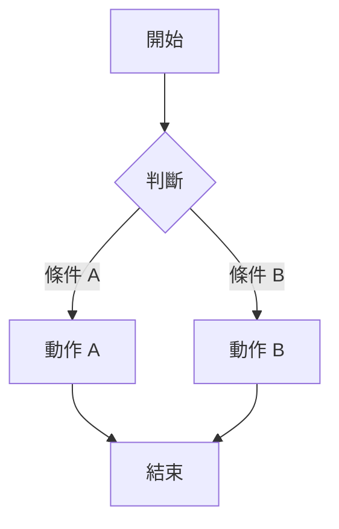

# FR-{xxx}: {功能需求標題}

> **優先級**: CRITICAL | HIGH | MEDIUM | LOW
> **狀態**: 提案 | 分析中 | 已批准 | 實作中 | 已完成
> **建立日期**: {YYYY-MM-DD}
> **負責代理**: 專案協調者

---

## 需求摘要

{1-3 句描述功能需求}

## 業務背景

{為什麼需要這個功能}

## 功能描述

### 核心功能
1. {功能 1}
2. {功能 2}
3. {功能 3}

### 流程圖

## 涉及元件

| 元件 | 類型 | 影響 |
|------|------|------|
| {元件名稱} | 新增/修改 | {影響描述} |

## 用戶故事拆解

| US ID | 標題 | 優先級 |
|-------|------|--------|
| US-{xxx}-01 | {故事 1} | HIGH |
| US-{xxx}-02 | {故事 2} | MEDIUM |

## 技術考量

- **架構影響**: {描述}
- **效能考量**: {描述}
- **安全考量**: {描述}
- **相容性**: {描述}

## 驗收標準

- [ ] {標準 1}
- [ ] {標準 2}
- [ ] {標準 3}

## 風險評估

| 風險 | 影響 | 機率 | 緩解措施 |
|------|------|------|---------|
| {風險 1} | 高/中/低 | 高/中/低 | {措施} |

## 排程估算

| 階段 | 任務數 | 代理 |
|------|--------|------|
| 設計 | {n} | 專案協調者 |
| 後端 | {n} | AutoCAD/Odoo 開發者 |
| 前端 | {n} | WPF 開發者 |
| 測試 | {n} | QA 測試工程師 |
