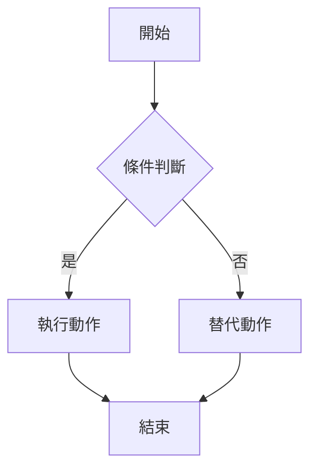

# 文件模板系統

## 概述

所有開發文件使用標準模板，確保格式一致、資訊完整。

## 可用模板

| 模板 | 編號格式 | 用途 |
|------|---------|------|
| `US_template.md` | US-{xxx}-{yy} | 用戶故事 (User Story) |
| `TASK_BE_template.md` | TASK-BE-{xxx}-{yy} | 後端開發任務 |
| `TASK_FE_template.md` | TASK-FE-{xxx}-{yy} | 前端開發任務 |
| `TS_template.md` | TS-{xxx}-{yy} | 測試規格 (Test Specification) |
| `BUG_template.md` | BUG-{xxx} | 缺陷報告 |
| `FR_template.md` | FR-{xxx} | 功能需求 (Feature Request) |

## 撰寫標準

### 語言
- 使用**正體中文**撰寫
- 技術術語保留英文

### 格式要求
- 使用 **Mermaid** 圖表描述流程
- 使用**表格**整理結構化資訊
- 程式碼範例使用對應語言的語法高亮標記
- 不使用 emoji（除非明確要求）

### Mermaid 圖表標準

### 編號規則
- **US-{功能編號}-{序號}**: 用戶故事（如 US-001-01）
- **TASK-BE-{功能編號}-{序號}**: 後端任務
- **TASK-FE-{功能編號}-{序號}**: 前端任務
- **TS-{功能編號}-{序號}**: 測試規格
- **BUG-{序號}**: 缺陷報告
- **FR-{序號}**: 功能需求

## 使用流程

1. **需求階段**: 使用 FR/US 模板記錄需求
2. **設計階段**: 使用 TASK-BE/TASK-FE 模板分解任務
3. **測試階段**: 使用 TS 模板設計測試案例
4. **維護階段**: 使用 BUG 模板記錄和追蹤缺陷

## 代理職責

| 代理 | 負責模板 |
|------|---------|
| 專案協調者 | FR, US, 任務分派 |
| WPF 開發者 | TASK-FE |
| AutoCAD/Odoo 開發者 | TASK-BE |
| QA 測試工程師 | TS, BUG |
