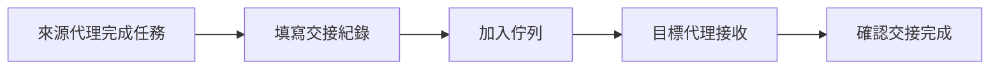

# 交接佇列

## 待處理交接

| ID | 來源代理 | 目標代理 | 任務 | 優先級 | 狀態 |
|----|---------|---------|------|--------|------|
| | | | | | |

## 進行中交接

| ID | 來源代理 | 目標代理 | 任務 | 開始時間 |
|----|---------|---------|------|---------|
| | | | | |

## 交接流程

## 優先級定義

| 優先級 | 說明 | 處理時限 |
|--------|------|---------|
| CRITICAL | 阻擋關鍵路徑 | 立即處理 |
| HIGH | Sprint 目標相關 | 當前 Sprint |
| MEDIUM | 改善項目 | 下個 Sprint |
| LOW | 技術債 | 排程處理 |
