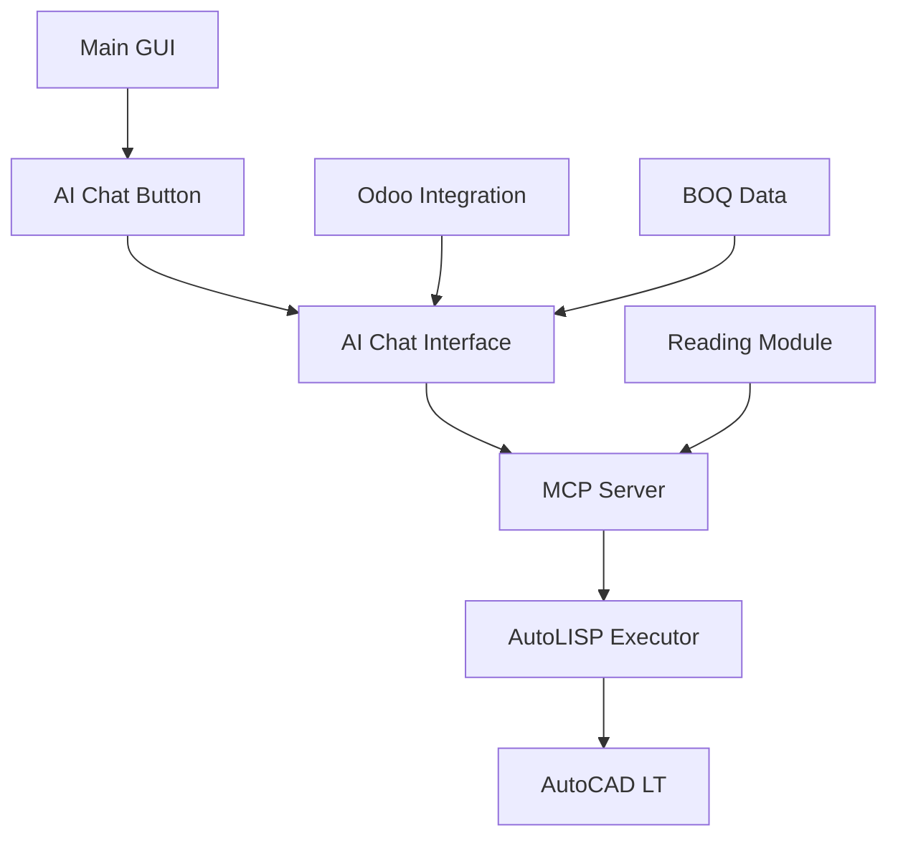
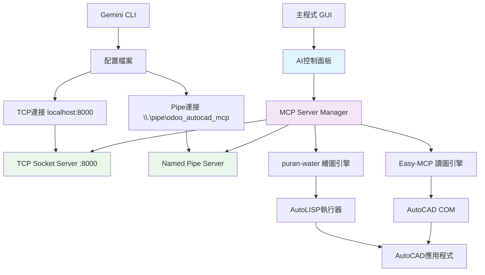

# AutoCAD MCP 整合方案

## 專案概述

本文件說明如何將 AutoCAD MCP 相關專案整合到現有的 `odoo_autocad` 專案中，提供 AI 驅動的 AutoCAD 操作功能。

## 候選專案比較

經過詳細分析兩個主要的 AutoCAD MCP 專案的**讀圖**和**繪圖**能力：

### 1. [puran-water/autocad-mcp](https://github.com/puran-water/autocad-mcp)
**繪圖能力** ⭐⭐⭐⭐⭐：
- ✅ **豐富的基礎圖形**：線條、圓形、多段線、矩形、弧形、橢圓
- ✅ **文字標註**：單行文字、多行文字、尺寸標註
- ✅ **進階功能**：區塊插入、填充、實體移動/旋轉
- ✅ **P&ID 專業工具**：600+ ISA 標準符號
- ✅ **圖層管理**：完整的圖層操作
- ✅ **自訂 AutoLISP**：執行客製化腳本

**讀圖能力** ❌：
- ❌ **無讀圖功能**
- ❌ **無資料提取**
- ❌ **無圖面分析**

### 2. [zh19980811/Easy-MCP-AutoCad](https://github.com/zh19980811/Easy-MCP-AutoCad)
**讀圖能力** ⭐⭐⭐⭐⭐：
- ✅ **實體掃描**：`scan_all_entities()` 
- ✅ **資料庫整合**：SQLite 儲存分析
- ✅ **實體查詢**：按類型查詢圖面元素
- ✅ **高亮顯示**：標記特定實體
- ✅ **文字搜尋**：圖面文字模式查詢

**繪圖能力** ⭐⭐：
- ✅ **基礎圖形**：線條、圓形
- ✅ **設備連接**：自動化連接線
- ❌ **缺少進階圖形**：無多段線、弧形、矩形等
- ❌ **無P&ID符號**
- ❌ **無文字標註**
- ❌ **功能相對簡單**

## **🚀 最佳整合策略：混合方案**

**單一專案都無法滿足完整需求！建議採用混合整合：**

1. **Easy-MCP-AutoCad** 作為 **讀圖核心**
2. **puran-water/autocad-mcp** 的繪圖工具作為 **繪圖引擎**
3. 整合兩者優勢到統一的 AI 助手中

## 1. 整合架構設計

### 1.1 目錄結構整合

建議採用**混合架構**整合兩個專案的優勢：

```
odoo_autocad/
├── ai_assistant/                    # 新增：AI助手模組
│   ├── __init__.py
│   ├── hybrid_mcp_server.py        # 混合MCP伺服器
│   ├── reading_engine/             # 讀圖引擎 (Easy-MCP-AutoCad)
│   │   ├── autocad_manager.py      # AutoCAD管理器
│   │   ├── db_manager.py           # 資料庫管理
│   │   └── entity_scanner.py       # 實體掃描器
│   ├── drawing_engine/             # 繪圖引擎 (puran-water)
│   │   ├── drawing_tools.py        # 基礎繪圖工具
│   │   ├── pid_symbols.py          # P&ID符號庫
│   │   └── lisp_executor.py        # AutoLISP執行器
│   ├── ai_chat_interface.py        # 統一AI對話介面
│   └── integration_bridge.py       # 整合橋接器
├── forms/
│   ├── form_ai_chat.py             # AI對話框表單
│   └── (existing forms...)
├── utility/
│   └── (existing utilities...)     # 重用現有BOQ/Odoo工具
└── (existing structure...)
```

### 1.2 技術架構



## 2. 功能分析與擴展

### 2.1 Easy-MCP-AutoCad 功能分析

**✅ 已支援功能：**
- **基礎繪圖**：線條、圓形等基本圖形
- **圖層管理**：創建、刪除、查詢圖層
- **讀圖功能** ⭐：`scan_all_entities()` 掃描所有實體
- **資料庫整合**：SQLite 儲存 CAD 實體資訊
- **實體查詢**：查詢特定類型的圖面元素
- **資料分析**：統計文字模式、實體屬性
- **自然語言處理**：MCP 協議支援

**🔧 需要擴展功能：**
- **表格資料讀取**：整合現有的 `get_table_data` 功能
- **BOQ 資料處理**：連接 Odoo 工作流程
- **進階圖面分析**：結合 AI 進行智能分析

### 2.2 整合現有功能的策略

**Easy-MCP-AutoCad 已有的核心功能：**
```python
# 已實現的讀圖功能
@mcp.tool()
async def scan_all_entities(context: Context):
    """掃描並記錄所有CAD實體到資料庫"""
    
@mcp.tool() 
async def query_entities_by_type(context: Context, entity_type: str):
    """查詢特定類型的實體"""

@mcp.tool()
async def highlight_entities(context: Context, entity_ids: str):
    """高亮顯示指定實體"""
```

**需要擴展的整合功能：**
```python
@mcp.tool()
async def extract_boq_tables(context: Context):
    """提取 BOQ 表格資料，整合現有 get_table_data 功能"""
    # 重用 util_autocad.py 的 get_layouts_values()
    
@mcp.tool()
async def analyze_drawing_for_odoo(context: Context):
    """分析圖面資料並準備 Odoo 整合"""
    # 結合現有的 BOQ 處理邏輯
    
@mcp.tool()
async def push_to_odoo_ai(context: Context, data: str):
    """AI 驅動的 Odoo 資料推送"""
    # 重用 util_push_to_boq.py 和 util_odoo.py
```

## 3. 啟動控制與通訊架構

### 3.1 手動啟動控制設計

採用**手動啟動控制**方案，在GUI中提供AI助手控制面板：

```python
# forms/form_main.py 或 form_main_modern.py
class FormMain:
    def create_ai_control_panel(self):
        """建立AI助手控制面板"""
        # 在左側sidebar新增AI控制區域
        ai_frame = ctk.CTkFrame(self.sidebar_frame)
        ai_frame.pack(fill="x", padx=10, pady=10)
        
        # AI助手狀態顯示
        self.mcp_status_label = ctk.CTkLabel(
            ai_frame,
            text="🔴 AI助手離線",
            font=("Microsoft JhengHei UI", 12)
        )
        self.mcp_status_label.pack(pady=5)
        
        # 控制按鈕組
        self.mcp_toggle_button = ctk.CTkButton(
            ai_frame,
            text="🚀 啟動AI助手",
            command=self.toggle_mcp_server,
            height=40,
            font=("Microsoft JhengHei UI", 12, "bold")
        )
        self.mcp_toggle_button.pack(fill="x", padx=5, pady=5)
        
        self.ai_chat_button = ctk.CTkButton(
            ai_frame,
            text="💬 AI對話",
            command=self.open_ai_chat,
            state="disabled",
            height=35
        )
        self.ai_chat_button.pack(fill="x", padx=5, pady=2)
        
        # 連接資訊顯示
        self.tcp_info_label = ctk.CTkLabel(ai_frame, text="TCP: 未啟動", font=("Microsoft JhengHei UI", 10))
        self.tcp_info_label.pack(anchor="w", padx=10)
        
        self.pipe_info_label = ctk.CTkLabel(ai_frame, text="Pipe: 未啟動", font=("Microsoft JhengHei UI", 10))
        self.pipe_info_label.pack(anchor="w", padx=10)
```

### 3.2 雙重通訊架構：TCP Socket + Named Pipe

實現同時支援TCP Socket和Named Pipe兩種通訊方式：

```python
# ai_assistant/mcp_server_manager.py
class MCPServerManager:
    """統一管理TCP和Named Pipe MCP服務"""
    
    def __init__(self, autocad_util, odoo_util, log_util, 
                 tcp_port=8000, pipe_name=r'\\.\pipe\odoo_autocad_mcp'):
        self.tcp_port = tcp_port
        self.pipe_name = pipe_name
        self.is_tcp_running = False
        self.is_pipe_running = False
    
    def start_all_servers(self):
        """同時啟動TCP和Pipe服務"""
        self.start_tcp_server()
        self.start_pipe_server()
    
    def start_tcp_server(self):
        """啟動TCP Socket服務"""
        self.tcp_server = socket.socket(socket.AF_INET, socket.SOCK_STREAM)
        self.tcp_server.bind(('localhost', self.tcp_port))
        self.tcp_server.listen(5)
        
        self.tcp_thread = threading.Thread(target=self._tcp_server_loop, daemon=True)
        self.tcp_thread.start()
        self.is_tcp_running = True
    
    def start_pipe_server(self):
        """啟動Named Pipe服務"""
        self.pipe_thread = threading.Thread(target=self._pipe_server_loop, daemon=True)
        self.pipe_thread.start()
        self.is_pipe_running = True
```

### 3.3 整合式啟動支援

主程式支援命令列參數，可作為純MCP服務或GUI+MCP混合模式運行：

```python
# odoo.py 修改
def main():
    parser = argparse.ArgumentParser(description='Odoo AutoCAD Integration')
    
    # MCP Server 模式
    parser.add_argument('--mcp-server', action='store_true',
                       help='Start as MCP server only (no GUI)')
    parser.add_argument('--mcp-port', type=int, default=8000,
                       help='MCP TCP server port')
    parser.add_argument('--mcp-pipe', type=str, 
                       default=r'\\.\pipe\odoo_autocad_mcp',
                       help='MCP Named Pipe name')
    parser.add_argument('--enable-mcp', action='store_true',
                       help='Enable MCP server in GUI mode')
    
    args = parser.parse_args()
    
    if args.mcp_server:
        # 純MCP server模式 (無GUI)
        start_mcp_server_only(args)
    else:
        # GUI模式 (可選擇性啟用MCP)
        start_gui_application(enable_mcp=args.enable_mcp, mcp_args=args)
```

### 3.4 Gemini CLI配置 (EXE部署)

為EXE檔案配置Gemini CLI，支援兩種通訊方式：

#### **TCP Socket配置**
```json
{
  "mcpServers": {
    "autocad-odoo-tcp": {
      "command": "C:/odoo/Odoo and AutoCAD Integration/odoo-autocad-integration.exe",
      "args": ["--mcp-server", "--mcp-port", "8000"],
      "env": {
        "AUTOCAD_PATH": "C:/Program Files/Autodesk/AutoCAD 2024",
        "PYTHONIOENCODING": "utf-8"
      },
      "transport": {
        "type": "tcp",
        "host": "localhost",
        "port": 8000
      }
    }
  }
}
```

#### **Named Pipe配置**
```json
{
  "mcpServers": {
    "autocad-odoo-pipe": {
      "command": "C:/odoo/Odoo and AutoCAD Integration/odoo-autocad-integration.exe",
      "args": ["--mcp-server", "--mcp-pipe", "\\\\.\\pipe\\odoo_autocad_mcp"],
      "env": {
        "AUTOCAD_PATH": "C:/Program Files/Autodesk/AutoCAD 2024"
      },
      "transport": {
        "type": "pipe",
        "name": "\\\\.\\pipe\\odoo_autocad_mcp"
      }
    }
  }
}
```

#### **混合配置 (推薦)**
```json
{
  "mcpServers": {
    "autocad-odoo": {
      "command": "C:/odoo/Odoo and AutoCAD Integration/odoo-autocad-integration.exe",
      "args": ["--mcp-server"],
      "env": {
        "AUTOCAD_PATH": "C:/Program Files/Autodesk/AutoCAD 2024",
        "MCP_TRANSPORT": "both"
      },
      "transport": [
        {
          "type": "tcp",
          "host": "localhost", 
          "port": 8000
        },
        {
          "type": "pipe",
          "name": "\\\\.\\pipe\\odoo_autocad_mcp"
        }
      ]
    }
  }
}
```

### 3.5 AI 對話框設計

```python
# forms/form_ai_chat.py
class FormAIChat:
    def __init__(self, parent, autocad_util, odoo_util, log_util):
        self.window = ctk.CTkToplevel(parent)
        self.setup_ui()
        self.mcp_server = MCPServer(autocad_util, odoo_util, log_util)
        
    def setup_ui(self):
        # 對話歷史區域
        self.chat_history = ctk.CTkTextbox(self.window, height=400)
        
        # 輸入區域
        self.input_frame = ctk.CTkFrame(self.window)
        self.input_text = ctk.CTkEntry(self.input_frame, placeholder_text="輸入 AI 指令...")
        self.send_button = ctk.CTkButton(self.input_frame, text="發送", command=self.send_message)
        
        # 快速指令按鈕
        self.create_quick_commands()
        
    def create_quick_commands(self):
        commands = [
            "讀取目前圖面的所有表格資料",
            "分析圖面中的BOQ資訊", 
            "畫一條從(0,0)到(100,100)的線",
            "讀取所有區塊的屬性資訊"
        ]
        # ... 建立快速指令按鈕 ...
```

## 4. 更新實施策略與優先級

### 4.1 實施方案確認

基於用戶需求確認，採用以下組合方案：

✅ **方案二：手動啟動控制** - 在GUI中提供AI助手控制面板  
✅ **解決方案二：整合式啟動** - 主程式支援`--mcp-server`參數  
✅ **解決方案三：Socket通訊** - 同時支援TCP Socket + Named Pipe  
✅ **正確安裝路徑**：`C:/odoo/Odoo and AutoCAD Integration/`  

### 4.2 核心架構圖



## 5. 詳細實施步驟與時程表

### 📋 **更新總體時程：5-6週完整整合**

---

### **第一階段：MCP架構建立（第1-2週）**

#### 🎯 **目標**：建立混合MCP架構基礎

#### **週別 1：專案準備**
- [ ] **專案分析**
  - [ ] 深入研究 Easy-MCP-AutoCad 原始碼
  - [ ] 分析 puran-water/autocad-mcp 繪圖工具
  - [ ] 評估現有 util_autocad.py 相容性
  
- [ ] **環境設置**
  - [ ] 建立開發分支 `feature/ai-assistant`
  - [ ] 設置 Python 虛擬環境
  - [ ] 安裝 MCP 相關依賴套件

- [ ] **目錄架構建立**
  ```bash
  mkdir -p ai_assistant/{reading_engine,drawing_engine}
  touch ai_assistant/{__init__,hybrid_mcp_server,ai_chat_interface}.py
  ```

#### **週別 2：核心架構**
- [ ] **混合 MCP 伺服器設計**
  - [ ] 建立 `hybrid_mcp_server.py` 框架
  - [ ] 設計統一的工具註冊機制
  - [ ] 實作基礎錯誤處理

- [ ] **讀圖引擎整合**
  - [ ] 複製 Easy-MCP-AutoCad 核心檔案
  - [ ] 改編 `autocad_manager.py` 
  - [ ] 整合 SQLite 資料庫管理

- [ ] **依賴管理**
  - [ ] 更新 `requirements.txt`
  - [ ] 解決套件版本衝突
  - [ ] 測試基本 MCP 連線

---

### **第二階段：讀圖功能整合（第3-4週）**

#### 🎯 **目標**：實現完整的圖面資訊讀取能力

#### **週別 3：核心讀圖功能**
- [ ] **實體掃描器開發**
  - [ ] 實作 `entity_scanner.py`
  - [ ] 整合 `scan_all_entities()` 功能
  - [ ] 開發實體類型分類邏輯

- [ ] **表格資料整合**
  - [ ] 擴展現有 `get_table_data()` 功能
  - [ ] 實作 `extract_boq_tables()` 工具
  - [ ] 建立表格資料標準化格式

- [ ] **資料庫優化**
  - [ ] 設計 CAD 實體資料表結構
  - [ ] 實作資料快取機制
  - [ ] 建立資料查詢 API

#### **週別 4：進階分析功能**
- [ ] **智能圖面分析**
  - [ ] 實作 `analyze_drawing_for_odoo()` 
  - [ ] BOQ 資料完整性檢查
  - [ ] 圖面元素關聯性分析

- [ ] **Odoo 資料橋接**
  - [ ] 整合現有 `util_odoo.py` 功能
  - [ ] 實作 `push_to_odoo_ai()` 工具
  - [ ] 建立資料轉換管道

- [ ] **測試與驗證**
  - [ ] 讀圖功能單元測試
  - [ ] 資料精準度驗證
  - [ ] 效能基準測試

---

### **第三階段：繪圖引擎整合（第4-5週）**

#### 🎯 **目標**：整合豐富的 AutoCAD 繪圖工具

#### **週別 4-5：繪圖工具移植**
- [ ] **基礎繪圖工具**
  - [ ] 移植 puran-water 的線條、圓形工具
  - [ ] 實作多段線、矩形、弧形工具
  - [ ] 整合橢圓、填充功能

- [ ] **文字與標註**
  - [ ] 實作單行文字、多行文字工具
  - [ ] 整合尺寸標註功能
  - [ ] 建立文字樣式管理

- [ ] **進階功能**
  - [ ] 區塊插入與管理
  - [ ] 實體移動、旋轉、複製
  - [ ] 圖層管理與屬性設置

- [ ] **AutoLISP 執行器**
  - [ ] 整合 LISP 腳本執行功能
  - [ ] 建立常用 LISP 函式庫
  - [ ] 實作自訂指令支援

---

### **第四階段：AI 對話介面開發（第5-6週）**

#### 🎯 **目標**：建立直觀的使用者 AI 互動介面

#### **週別 5：UI 基礎架構**
- [ ] **主介面整合**
  - [ ] 在 sidebar 新增 "🤖 AI 助手" 按鈕
  - [ ] 修改 `form_main.py` 或 `form_main_modern.py`
  - [ ] 實作 `open_ai_chat()` 方法

- [ ] **對話框設計**
  - [ ] 建立 `form_ai_chat.py`
  - [ ] 實作對話歷史顯示區域
  - [ ] 設計輸入框與發送按鈕

#### **週別 6：互動功能完善**
- [ ] **快速指令系統**
  - [ ] 建立預設指令範本
  - [ ] 實作一鍵執行按鈕
  - [ ] 設計指令分類與搜尋

- [ ] **自然語言處理**
  - [ ] 整合 MCP 協議通訊
  - [ ] 實作指令解析與路由
  - [ ] 建立回應格式化顯示

- [ ] **狀態與回饋**
  - [ ] 實作操作進度顯示
  - [ ] 整合現有日誌系統
  - [ ] 建立錯誤訊息處理

---

### **第五階段：整合測試與優化（第6-7週）**

#### 🎯 **目標**：確保系統穩定性與效能

#### **週別 6-7：系統整合**
- [ ] **功能整合測試**
  - [ ] 讀圖 + 繪圖功能聯合測試
  - [ ] Odoo 資料流程端對端測試
  - [ ] AutoCAD 版本相容性測試

- [ ] **效能優化**
  - [ ] 批次操作優化
  - [ ] 記憶體使用最佳化
  - [ ] 回應時間改善

- [ ] **使用者體驗優化**
  - [ ] 介面響應性改善
  - [ ] 錯誤處理友善化
  - [ ] 操作流程簡化

---

### **第六階段：文件與部署（第7-8週）**

#### 🎯 **目標**：完成專案交付準備

#### **週別 7：文件撰寫**
- [ ] **技術文件**
  - [ ] API 文件更新
  - [ ] 架構設計文件
  - [ ] 部署指南撰寫

- [ ] **使用者文件**
  - [ ] 功能使用說明
  - [ ] 常見問題 FAQ
  - [ ] 疑難排解指南

#### **週別 8：發布準備**
- [ ] **最終測試**
  - [ ] 完整功能驗收測試
  - [ ] 多環境部署測試
  - [ ] 效能壓力測試

- [ ] **版本發布**
  - [ ] 版本號碼管理
  - [ ] 發布說明撰寫
  - [ ] 用戶培訓準備

---

## 6. 更新版 Todo List 檢核表

### **🚀 階段一：MCP架構建立（即刻開始）**
- [ ] **專案研究分析**
  - [ ] Clone Easy-MCP-AutoCad 專案到本機深入研究
  - [ ] Clone puran-water/autocad-mcp 專案到本機分析
  - [ ] 研究現有util_autocad.py與MCP的整合可能性
  
- [ ] **開發環境準備**
  - [ ] 建立開發分支 `feature/mcp-integration`
  - [ ] 建立基礎目錄結構 `ai_assistant/`
  - [ ] 設置MCP開發虛擬環境和依賴套件

- [ ] **基礎架構建立**
  - [ ] 實作MCPServerManager - 統一管理TCP和Pipe服務
  - [ ] 修改odoo.py主程式支援`--mcp-server`參數
  - [ ] 建立雙重通訊架構 (TCP Socket + Named Pipe)

### **📋 階段二：GUI控制面板開發（第1-2週）**
- [ ] **AI控制面板UI**
  - [ ] 在forms/form_main.py新增AI助手控制區域
  - [ ] 實作啟動/停止/重啟AI助手按鈕
  - [ ] 添加TCP/Pipe服務狀態即時顯示
  
- [ ] **狀態監控整合**
  - [ ] 整合現有StatusIndicator組件顯示MCP狀態
  - [ ] 實作連接資訊顯示 (端口號、管道名稱等)
  - [ ] 建立錯誤處理和友善提示機制

### **🎯 階段三：MCP請求處理器（第2-3週）**
- [ ] **現有功能整合**
  - [ ] 重用util_autocad.py的scan_all_entities功能
  - [ ] 整合util_odoo.py的BOQ和產品查詢功能
  - [ ] 實作JSON格式的MCP請求/回應協議
  
- [ ] **雙引擎架構實現**
  - [ ] 整合Easy-MCP-AutoCad的讀圖核心
  - [ ] 移植puran-water的豐富繪圖工具
  - [ ] 建立統一的工具註冊和路由機制

### **🔧 階段四：Gemini CLI配置與部署（第3-4週）**
- [ ] **EXE部署配置**
  - [ ] 更新PyInstaller建置腳本支援MCP功能
  - [ ] 建立Gemini CLI配置範本 (TCP, Pipe, 混合模式)
  - [ ] 驗證C:/odoo/Odoo and AutoCAD Integration/路徑配置
  
- [ ] **端對端測試**
  - [ ] 測試GUI模式下的MCP服務啟動
  - [ ] 驗證純MCP server模式運行
  - [ ] 確認Gemini CLI連接和指令執行

### **⚠️ 關鍵風險監控點**
- [ ] **第1週**: 套件相依性衝突解決 (MCP版本相容性)
- [ ] **第2週**: AutoCAD COM與Socket/Pipe的並行執行驗證
- [ ] **第3週**: 雙引擎架構的記憶體使用量監控
- [ ] **第4週**: EXE檔案的MCP功能完整性測試

### **📊 更新版成功指標**
- [ ] MCP服務啟動時間 < 5秒
- [ ] AI指令回應時間 < 3秒
- [ ] TCP和Pipe雙重連接穩定性 > 99%
- [ ] GUI和MCP混合模式穩定運行 > 4小時
- [ ] Gemini CLI指令執行成功率 > 95%

### **🎁 預期交付成果**
- [ ] **完整的AI助手控制面板** - 使用者可在GUI中方便管理MCP服務
- [ ] **雙重通訊支援** - TCP Socket + Named Pipe提供連接冗餘
- [ ] **無縫Gemini CLI整合** - AI可直接操作AutoCAD和Odoo功能
- [ ] **完整的使用者文件** - 配置指南和操作說明

## 5. 技術挑戰與解決方案

### 5.1 讀圖功能實現

**挑戰：** 原 MCP 專案不支援讀圖
**解決方案：**
```python
# ai_assistant/drawing_reader.py
class DrawingReader:
    def __init__(self, autocad_util):
        self.autocad_util = autocad_util
        
    def read_all_tables(self):
        """讀取所有表格並整合現有的 get_table_data 功能"""
        return self.autocad_util.get_layouts_values()
        
    def extract_entity_info(self):
        """提取實體資訊，擴展現有功能"""
        # 整合現有的 util_autocad.py 功能
```

### 5.2 整合現有工具

```python
# ai_assistant/mcp_integration.py
class MCPIntegration:
    def __init__(self, autocad_util, odoo_util):
        self.autocad_util = autocad_util  # 重用現有工具
        self.odoo_util = odoo_util        # 重用現有工具
        
    @tool()
    def push_to_boq_ai(self, data):
        """AI 驅動的 BOQ 推送"""
        # 重用 util_push_to_boq.py
        
    @tool() 
    def get_odoo_products_ai(self, query):
        """AI 驅動的產品查詢"""
        # 重用 util_odoo.py
```

## 6. 預期效益

### 6.1 使用者體驗提升
- **自然語言操作**：「幫我讀取這張圖的BOQ資料」
- **智能分析**：「分析這張圖缺少哪些必要資訊」
- **快速操作**：「將這些資料推送到Odoo專案XYZ」

### 6.2 工作流程優化
- **減少手動操作**：AI 自動化重複性任務
- **提升準確性**：AI 協助驗證資料完整性
- **加速學習**：新使用者可透過自然語言快速上手

## 7. 風險評估與緩解

| 風險 | 影響程度 | 緩解策略 |
|------|----------|----------|
| 相依性衝突 | 中 | 使用虛擬環境，仔細管理套件版本 |
| 效能問題 | 中 | 實作快取機制，優化批次操作 |
| AutoCAD 相容性 | 高 | 充分測試不同版本，提供降級選項 |
| 學習曲線 | 低 | 提供豐富的預設範例和說明文件 |

## 8. 後續發展方向

### 8.1 進階 AI 功能
- **圖面智能審查**：檢查圖面符合性
- **自動 BOQ 生成**：從圖面自動產生材料清單
- **設計建議**：基於最佳實務提供改進建議

### 8.2 雲端整合
- **遠端 AI 模型**：支援更強大的雲端 AI
- **協同作業**：多人同時使用 AI 助手
- **學習機制**：累積使用模式優化回應

## 9. 結論

整合 AutoCAD MCP 到現有專案將大幅提升使用者體驗，提供 AI 驅動的智能 CAD 操作功能。雖然需要額外開發讀圖功能，但可以充分重用現有的架構和工具，實現成本效益最大化。

建議採用分階段實作策略，優先實現基礎整合，再逐步擴展進階功能。這樣既能快速看到成效，又能確保系統穩定性。