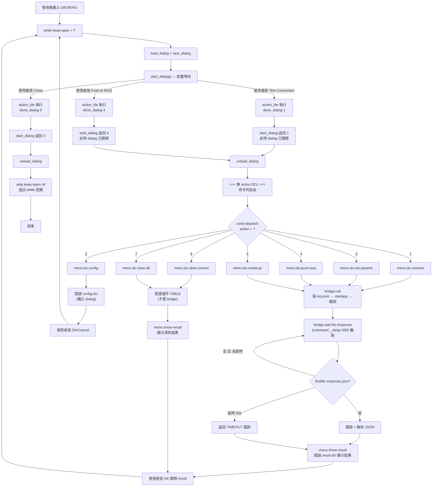
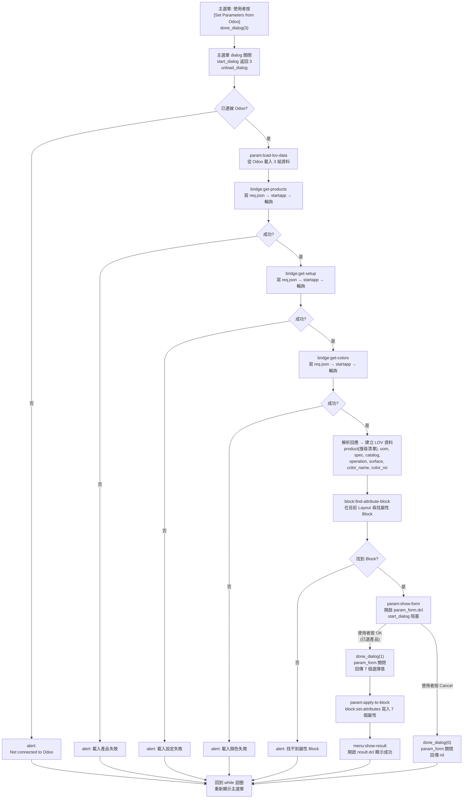
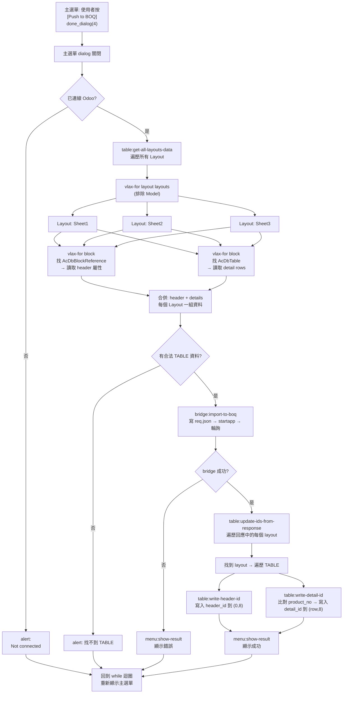
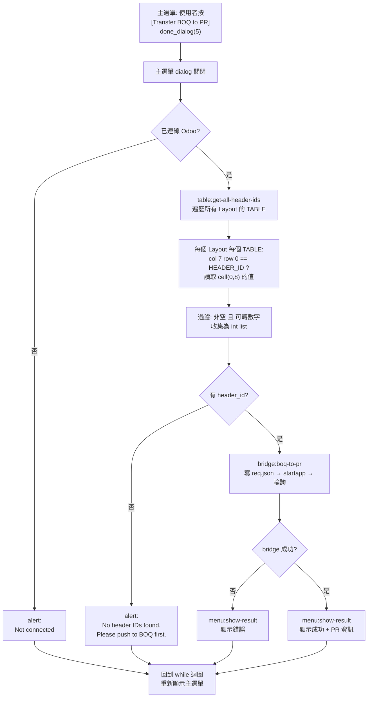

# DCL + Bridge 執行流程說明

> 版本: 2.0
> 日期: 2026-03-06
> 目的: 說明 DCL 對話框與 Python Bridge 輪詢如何在 AutoCAD 中安全共存

---

## 1. 核心問題

AutoCAD 的 `start_dialog()` 會阻塞 LISP 執行，期間禁止使用 `(command ...)`。
而 Bridge 輪詢 `wait-for-response` 必須使用 `(command "_.delay" 500)` 等待回應。

**兩者不能同時執行。**

---

## 2. 解法：done_dialog 立即關閉

按鈕的 `action_tile` 不在 dialog 內執行工作，而是用 `(done_dialog N)` **立刻關閉 dialog**，
讓 `start_dialog` 返回 N，之後在 dialog 外執行 Bridge 輪詢。

```
action_tile "btn_connect" "(done_dialog 1)"
                            ^^^^^^^^^^^^
                            不是「在 dialog 裡呼叫 bridge」
                            而是「關閉 dialog，把 1 傳回給 start_dialog」
```

---

## 3. Mermaid 流程圖



---

## 4. ASCII 畫面操作時序

### 步驟 1: 主選單顯示（dialog active — 阻塞中）

```
╔══════════════════════════════════════╗
║  Odoo-AutoCAD Integration           ║
╠══════════════════════════════════════╣
║  Status: Odoo: Not Connected        ║
╠══════════════════════════════════════╣
║  Connection                         ║
║  [Test Odoo Connection]  ◄── 按此   ║
║  [Connection Settings...]           ║
╠══════════════════════════════════════╣
║  Main Functions                     ║
║  [Set Parameters from Odoo]         ║
║  [Push to BOQ]                      ║
║  [Transfer BOQ to PR]               ║
╠══════════════════════════════════════╣
║  Tools                              ║
║  [Clear Current Layout Table IDs]   ║
║  [Clear ALL Layout Table IDs]       ║
╠══════════════════════════════════════╣
║              [Close]                 ║
╚══════════════════════════════════════╝

AutoCAD Command: _                ← LISP 在 start_dialog() 阻塞
                                    使用者無法在命令列輸入
                                    只能在 dialog 上操作
```

### 步驟 2: 按下按鈕 → dialog 消失 → 輪詢開始

```
使用者按 [Test Odoo Connection]
  → action_tile 執行 (done_dialog 1)
  → dialog 立刻消失！
  → start_dialog 返回 1
  → unload_dialog 釋放資源

╔══════════════════════════════════════╗
║                                     ║
║     （對話框已消失）                  ║
║     （只剩 AutoCAD 繪圖區）           ║
║                                     ║
╚══════════════════════════════════════╝

AutoCAD Command: [OB] Testing Odoo connection...
                 [OB] Waiting for bridge response.......... OK
                 ^^^^^^^^^^^^^^^^^^^^^^^^^^^^^^^^^^^^^^^^^^
                 此處 NO active dialog
                 (command "_.delay" 500) 合法
                 每 0.5 秒印一個點
                 bridge.exe 在背景處理 Odoo API
```

### 步驟 3: Bridge 回應 → 結果對話框

```
bridge.exe 完成 → 寫出 response.json
LISP 偵測到檔案 → 讀取 JSON → 開啟結果 dialog

╔══════════════════════════════════════╗
║  Connection Test                    ║
╠══════════════════════════════════════╣
║  Success!                           ║
║  Server: Odoo 16.0                  ║
║                                     ║
║                                     ║
║                                     ║
╠══════════════════════════════════════╣
║              [ OK ]  ◄── 按此       ║
╚══════════════════════════════════════╝

AutoCAD Command: _                ← 又一個 start_dialog 阻塞
                                    等待使用者按 OK
```

### 步驟 4: 按 OK → 回到 while 迴圈 → 主選單重新顯示

```
使用者按 OK
  → done_dialog → result dialog 消失
  → 回到 while 迴圈頂端
  → load_dialog + new_dialog 重新開啟主選單

╔══════════════════════════════════════╗
║  Odoo-AutoCAD Integration           ║
╠══════════════════════════════════════╣
║  Status: Odoo: Connected  ◄── 已更新 ║
╠══════════════════════════════════════╣
║  Connection                         ║
║  [Test Odoo Connection]             ║
║  [Connection Settings...]           ║
╠══════════════════════════════════════╣
║  Main Functions                     ║
║  [Set Parameters from Odoo]         ║
║  [Push to BOQ]                      ║
║  [Transfer BOQ to PR]               ║
╠══════════════════════════════════════╣
║  Tools                              ║
║  [Clear Current Layout Table IDs]   ║
║  [Clear ALL Layout Table IDs]       ║
╠══════════════════════════════════════╣
║              [Close]                 ║
╚══════════════════════════════════════╝

AutoCAD Command: _                ← start_dialog 再次阻塞
                                    等待使用者下一步操作
```

---

## 5. Push to BOQ 完整流程（最複雜的場景）

```
步驟 1: 主選單 → 按 [Push to BOQ] → done_dialog(4) → dialog 消失

步驟 2: (無 dialog) 收集 TABLE 資料
AutoCAD Command: [OB] Collecting TABLE data from all layouts...
                 [OB] Processing layout: Sheet1
                 [OB] Processing layout: Sheet2
                 [OB] Processing layout: Sheet3

步驟 3: (無 dialog) 呼叫 Bridge 推送
AutoCAD Command: [OB] Pushing to Odoo BOQ...
                 [OB] Waiting for bridge response.............. OK

步驟 4: (無 dialog) 回寫 ID 到 TABLE
AutoCAD Command: [OB] Writing back IDs to tables...

步驟 5: 顯示結果 dialog
╔══════════════════════════════════════╗
║  Push to BOQ                        ║
╠══════════════════════════════════════╣
║  Successfully imported to BOQ!      ║
║  IDs written back to tables.        ║
╠══════════════════════════════════════╣
║              [ OK ]                  ║
╚══════════════════════════════════════╝

步驟 6: 按 OK → while 迴圈 → 主選單重新顯示（Status 保持 Connected）
```

---

## 6. 錯誤理解 vs 正確理解

### 錯誤理解（不是我們的做法）

```
start_dialog 阻塞
     │
     ├── 使用者按按鈕
     │    └── action_tile callback 內:
     │         ├── bridge:call          ← ✗ 不行
     │         │    └── startapp
     │         │    └── (command _.delay) ← ✗ 爆炸! dialog 還 active
     │         └── 顯示結果              ← ✗ 不能開第二個 dialog
     │
     └── start_dialog 繼續阻塞...       ← 永遠卡在這裡
```

### 正確理解（我們的做法）

```
start_dialog 阻塞
     │
     ├── 使用者按按鈕
     │    └── action_tile: (done_dialog 1)   ← 只做這一件事
     │         └── dialog 立刻關閉
     │
start_dialog 返回 1                         ← 阻塞結束
     │
unload_dialog                               ← dialog 完全釋放
     │
cond action=1                               ← 純 LISP 邏輯分支
     │
menu:do-connect                             ← 此時沒有任何 dialog
     ├── bridge:call                         ← ✓ 合法
     │    ├── file:write-string              ← ✓ 合法
     │    ├── startapp bridge.exe            ← ✓ 合法
     │    └── wait-for-response              ← ✓ 合法
     │         └── (command "_.delay" 500)   ← ✓ 沒有 active dialog
     │
     └── menu:show-result                    ← ✓ 開新 dialog (result.dcl)
          └── start_dialog → 使用者按 OK → done_dialog → 返回
     │
while 迴圈頂端                              ← 重新開啟主選單
     └── load_dialog → new_dialog → start_dialog 阻塞
```

---

## 7. 三個 dialog 的生命週期

同一時間永遠只有一個 dialog active：

```
時間 ──────────────────────────────────────────────────────────────────>

main_menu.dcl  ████████░░░░░░░░░░░░░░░░░░░░░░░░░░░████████░░░░░
               load  close                          load  close
                     ↓                              ↑
                (action=1)                     (while 迴圈)
                     ↓                              ↑
(無 dialog)    ░░░░░░░░░░████████████████████░░░░░░░░░░░░░░░░░░░
                         bridge:call          ↑
                         wait-for-response    │
                         ↓                    │
result.dcl     ░░░░░░░░░░░░░░░░░░░░░░░░░████░░░░░░░░░░░░░░░░░░░
                                        load close
                                             ↑
                                          (OK 按鈕)

圖例: ████ = dialog active (start_dialog 阻塞中)
      ░░░░ = 無 dialog (可自由使用 command)
```

---

## 8. 總結

| 階段 | Dialog 狀態 | `(command)` 可用 | 說明 |
|------|:-----------:|:----------------:|------|
| 主選單顯示中 | active | 不可 | `start_dialog` 阻塞 |
| 按下按鈕後 | **已關閉** | **可以** | `done_dialog` → `unload_dialog` |
| Bridge 輪詢中 | 已關閉 | **可以** | `(command "_.delay" 500)` 合法 |
| 結果對話框中 | active | 不可 | 另一個 `start_dialog` 阻塞 |
| 按 OK 後 | **已關閉** | **可以** | 回到 while 迴圈重開主選單 |

---
---

# 三大功能詳細流程

以下針對 **Set Parameters from Odoo**、**Push to BOQ**、**Transfer BOQ to PR** 三個主要功能，分別畫出 Mermaid 流程圖與 ASCII 畫面時序。

---

## A. Set Parameters from Odoo（action = 3）

### A.1 Mermaid 流程圖



### A.2 ASCII 畫面時序

```
步驟 1: 主選單 → 按 [Set Parameters from Odoo] → done_dialog(3)
╔══════════════════════════════════════╗
║  Odoo-AutoCAD Integration           ║
╠══════════════════════════════════════╣
║  Status: Odoo: Connected            ║
╠══════════════════════════════════════╣
║  [Set Parameters from Odoo] ◄── 按  ║
║  [Push to BOQ]                      ║
║  [Transfer BOQ to PR]               ║
╚══════════════════════════════════════╝
→ done_dialog(3) → dialog 消失
```

```
步驟 2: (無 dialog) 3 次 Bridge 呼叫載入 LOV 資料
╔══════════════════════════════════════════════════════════╗
║                                                         ║
║              （主選單已消失，繪圖區可見）                    ║
║                                                         ║
╚══════════════════════════════════════════════════════════╝

Command: [OB] Loading products from Odoo...
         [OB] Waiting for bridge response....... OK      ← 第 1 次 bridge call
         [OB] Loading setup values...
         [OB] Waiting for bridge response..... OK        ← 第 2 次 bridge call
         [OB] Loading colors...
         [OB] Waiting for bridge response.... OK         ← 第 3 次 bridge call

⚠️ 注意：此處連續 3 次 bridge 呼叫，每次都是
   寫 req.json → startapp → (command "_.delay" 500) 輪詢 → 讀 resp.json
   全程無 active dialog，(command) 合法
```

```
步驟 3: (無 dialog) 在目前 Layout 尋找屬性 Block

Command: （LISP 內部搜尋 AcDbBlockReference，無畫面輸出）

  找到 Block 的條件：
  - ObjectName = "AcDbBlockReference"
  - 有 "project_name" 或 "job_working_plan_name" 屬性 tag

  AutoCAD 繪圖中的 Block 長這樣：
  ┌─────────────────────────────────────┐
  │  project_name: "某某專案"            │ ← 屬性
  │  job_working_plan_name: "WP-001"    │ ← 屬性
  │  product_name: ""                   │ ← 待填入
  │  spec: ""                           │ ← 待填入
  │  product_catelog: ""                │ ← 待填入
  │  operation_flow: ""                 │ ← 待填入
  │  surface_treatment: ""              │ ← 待填入
  │  color_name: ""                     │ ← 待填入
  │  color_no: ""                       │ ← 待填入
  └─────────────────────────────────────┘
```

```
步驟 4: 開啟參數選擇 DCL 表單（start_dialog 阻塞）

╔══════════════════════════════════════════════════╗
║  Set Parameters                                   ║
╠══════════════════════════════════════════════════╣
║  Material ──────────────────────────────────      ║
║  │ Product Search: [鍍鋅________] [片 ]           ║
║  │                                 ^^^             ║
║  │                         (UOM 自動填入，唯讀)     ║
║  │ ┌──────────────────────────────────────────┐   ║
║  │ │ 鍍鋅鋼板 0.4mm                          │   ║
║  │ │ 鍍鋅鋼板 0.5mm          ◄── 過濾結果     │   ║
║  │ │ 鍍鋅鋼板 0.6mm                          │   ║
║  │ │ 鍍鋅鋼板 0.8mm                          │   ║
║  │ │ 鍍鋅鋼板 1.0mm                          │   ║
║  │ │ 鍍鋅鋼板 1.2mm          ◄── 點選此項     │   ║
║  │ │                                          │   ║
║  │ │                                          │   ║
║  │ └──────────────────────────────────────────┘   ║
║  │ Spec:             [1.2mm ▼]                    ║
║  │ Product Catalog:  [板材 ▼]                     ║
║  └──────────────────────────────────────────      ║
║                                                    ║
║  Processing ────────────────────────────────      ║
║  │ Operation Flow:     [沖壓 → 折彎 ▼]            ║
║  │ Surface Treatment:  [粉體烤漆 ▼]               ║
║  └──────────────────────────────────────────      ║
║                                                    ║
║  Color ─────────────────────────────────────      ║
║  │ Color Name: [RAL 9010 白 ▼] [RAL9010]         ║
║  │                               ^^^              ║
║  │                         (色號自動填入，唯讀)     ║
║  └──────────────────────────────────────────      ║
║                                                    ║
║          [ OK ]          [ Cancel ]               ║
╚══════════════════════════════════════════════════╝

Command: _                ← start_dialog 阻塞中

互動行為（在 dialog 內，不需 command）：
  - 在 Product Search 輸入關鍵字 → 按 Enter → list_box 過濾顯示
  - 點選 list_box 中的產品 → UOM 欄位自動更新
  - 輸入空白關鍵字 → 按 Enter → 顯示全部產品
  - 選擇 Color Name → Color No 欄位自動更新
  - 按 OK → 檢查是否已選產品 → done_dialog(1)
  - 按 Cancel → done_dialog(0)，回傳 nil
```

```
步驟 5: 按 OK → param_form 關閉 → 寫入 Block 屬性

╔══════════════════════════════════════════════════════════╗
║                                                         ║
║              （param_form 已消失，繪圖區可見）              ║
║                                                         ║
╚══════════════════════════════════════════════════════════╝

Command: [OB] Parameters written to block attributes

  Block 更新後：
  ┌─────────────────────────────────────┐
  │  project_name: "某某專案"            │
  │  job_working_plan_name: "WP-001"    │
  │  product_name: "鍍鋅鋼板"       ◄── │ 已寫入
  │  spec: "1.2mm"                  ◄── │ 已寫入
  │  product_catelog: "板材"         ◄── │ 已寫入
  │  operation_flow: "沖壓 → 折彎"   ◄── │ 已寫入
  │  surface_treatment: "粉體烤漆"   ◄── │ 已寫入
  │  color_name: "RAL 9010 白"      ◄── │ 已寫入
  │  color_no: "RAL9010"            ◄── │ 已寫入
  └─────────────────────────────────────┘
```

```
步驟 6: 結果對話框
╔══════════════════════════════════════╗
║  Set Parameters                     ║
╠══════════════════════════════════════╣
║  Parameters applied successfully!   ║
╠══════════════════════════════════════╣
║              [ OK ]                  ║
╚══════════════════════════════════════╝

步驟 7: 按 OK → while 迴圈 → 主選單重新顯示
```

### A.3 Dialog 生命週期（Set Parameters）

```
時間 ────────────────────────────────────────────────────────────────────────>

main_menu.dcl   ████░░░░░░░░░░░░░░░░░░░░░░░░░░░░░░░░░░░░░░░░░░░░░░░░████
                close                                                  open
                  ↓                                                     ↑
(bridge 輪詢)   ░░████████████████░░░░░░░░░░░░░░░░░░░░░░░░░░░░░░░░░░░░░
                  get_products     ↓
                  get_setup        ↓
                  get_colors       ↓
                                   ↓
param_form.dcl  ░░░░░░░░░░░░░░░░░░████████████████░░░░░░░░░░░░░░░░░░░░░
                                   open   使用者選擇   close
                                                       ↓
(寫入屬性)      ░░░░░░░░░░░░░░░░░░░░░░░░░░░░░░░░░░░██░░░░░░░░░░░░░░░░░
                                                    write
                                                       ↓
result.dcl      ░░░░░░░░░░░░░░░░░░░░░░░░░░░░░░░░░░░░░████░░░░░░░░░░░░░
                                                       open close
                                                            ↑
                                                         (OK 按鈕)
```

---

## B. Push to BOQ（action = 4）

### B.1 Mermaid 流程圖



### B.2 ASCII 畫面時序

```
步驟 1: 主選單 → 按 [Push to BOQ] → done_dialog(4) → dialog 消失
╔══════════════════════════════════════╗
║  ...                                 ║
║  [Set Parameters from Odoo]         ║
║  [Push to BOQ]              ◄── 按  ║
║  [Transfer BOQ to PR]               ║
║  ...                                 ║
╚══════════════════════════════════════╝
→ done_dialog(4) → dialog 消失
```

```
步驟 2: (無 dialog) 遍歷所有 Layout 收集 TABLE 資料
╔══════════════════════════════════════════════════════════╗
║                                                         ║
║              （主選單已消失，繪圖區可見）                    ║
║                                                         ║
╚══════════════════════════════════════════════════════════╝

Command: [OB] Collecting TABLE data from all layouts...
         [OB] Processing layout: Sheet1
         [OB] Processing layout: Sheet2
         [OB] Processing layout: Sheet3

  每個 Layout 中尋找的 TABLE 結構 (9 欄):
  ┌────────┬──────────┬─────┬─────┬─────┬───────┬─────┬──────────┬───────────┐
  │        │          │     │     │     │       │     │ HEADER_ID│ (空)      │← row 0
  ├────────┼──────────┼─────┼─────┼─────┼───────┼─────┼──────────┼───────────┤
  │ 位置   │ 料號     │ 寬  │ 高  │ 長  │ 厚    │ 數量│ 說明     │ detail_id │← row 1
  ├────────┼──────────┼─────┼─────┼─────┼───────┼─────┼──────────┼───────────┤
  │ A-01   │ SUS304   │ 100 │ 200 │ 300 │ 1.2   │ 5   │ 門板     │ (空)      │← row 2
  │ A-02   │ SGCC     │ 50  │ 100 │ 150 │ 0.8   │ 10  │ 側板     │ (空)      │← row 3
  │ A-03   │ AL5052   │ 80  │ 80  │ 200 │ 2.0   │ 3   │ 底板     │ (空)      │← row 4
  └────────┴──────────┴─────┴─────┴─────┴───────┴─────┴──────────┴───────────┘
     col 0    col 1    col 2 col 3 col 4  col 5  col 6  col 7      col 8

  讀取規則:
    - col 7 row 0 必須是 "HEADER_ID" 才是合法 TABLE
    - row 2 以後: qty (col 6) > 0 的列才收集
    - 每一列收集: position, product_no, width, height, len, thickness, qty, desc
```

```
步驟 3: (無 dialog) 呼叫 Bridge 推送到 Odoo BOQ

Command: [OB] Pushing to Odoo BOQ...
         [OB] Waiting for bridge response.................. OK
                                        ^^^^^^^^^^^^^^^^^^
                                        bridge.exe 執行中:
                                        1. 讀 req.json (所有 layout 資料)
                                        2. POST 到 Odoo /api/odoo-autocad/v2/import2boq_v2
                                        3. 收到回應 (header_id + detail_id)
                                        4. 寫 resp.json
```

```
步驟 4: (無 dialog) Odoo 回傳 ID → 回寫到 TABLE

Command: [OB] Writing back IDs to tables...

  Odoo 回傳的資料結構:
  {
    "all": [
      {
        "header_id": 456,
        "layout_name": "Sheet1",
        "detail": [
          {"product_no": "SUS304", "detail_id": 1001},
          {"product_no": "SGCC",   "detail_id": 1002},
          {"product_no": "AL5052", "detail_id": 1003}
        ]
      },
      { "header_id": 457, "layout_name": "Sheet2", ... },
      ...
    ]
  }

  回寫後的 TABLE:
  ┌────────┬──────────┬─────┬─────┬─────┬───────┬─────┬──────────┬───────────┐
  │        │          │     │     │     │       │     │ HEADER_ID│ 456       │← 寫入!
  ├────────┼──────────┼─────┼─────┼─────┼───────┼─────┼──────────┼───────────┤
  │ 位置   │ 料號     │ 寬  │ 高  │ 長  │ 厚    │ 數量│ 說明     │ detail_id │
  ├────────┼──────────┼─────┼─────┼─────┼───────┼─────┼──────────┼───────────┤
  │ A-01   │ SUS304   │ 100 │ 200 │ 300 │ 1.2   │ 5   │ 門板     │ 1001      │← 寫入!
  │ A-02   │ SGCC     │ 50  │ 100 │ 150 │ 0.8   │ 10  │ 側板     │ 1002      │← 寫入!
  │ A-03   │ AL5052   │ 80  │ 80  │ 200 │ 2.0   │ 3   │ 底板     │ 1003      │← 寫入!
  └────────┴──────────┴─────┴─────┴─────┴───────┴─────┴──────────┴───────────┘

  回寫邏輯:
    - header_id → 寫入 cell(0, 8)
    - detail_id → 比對 col 1 (product_no) 找到對應 row → 寫入 cell(row, 8)
```

```
步驟 5: 結果對話框
╔══════════════════════════════════════╗
║  Push to BOQ                        ║
╠══════════════════════════════════════╣
║  Successfully imported to BOQ!      ║
║  IDs written back to tables.        ║
╠══════════════════════════════════════╣
║              [ OK ]                  ║
╚══════════════════════════════════════╝

步驟 6: 按 OK → while 迴圈 → 主選單重新顯示
```

### B.3 Dialog 生命週期（Push to BOQ）

```
時間 ────────────────────────────────────────────────────────────────────>

main_menu.dcl   ████░░░░░░░░░░░░░░░░░░░░░░░░░░░░░░░░░░░░░░░░░░░████
                close                                              open
                  ↓                                                 ↑
(收集 TABLE)    ░░████░░░░░░░░░░░░░░░░░░░░░░░░░░░░░░░░░░░░░░░░░░░░
                  遍歷 Layout                                       ↑
                      ↓                                             ↑
(bridge 輪詢)   ░░░░░░██████████████████░░░░░░░░░░░░░░░░░░░░░░░░░░░
                      import-to-boq      ↓                          ↑
                      wait-for-response  ↓                          ↑
                                         ↓                          ↑
(回寫 ID)       ░░░░░░░░░░░░░░░░░░░░░░░░██░░░░░░░░░░░░░░░░░░░░░░░░
                                         write-header-id            ↑
                                         write-detail-id            ↑
                                           ↓                        ↑
result.dcl      ░░░░░░░░░░░░░░░░░░░░░░░░░░████░░░░░░░░░░░░░░░░░░░░
                                           open close               ↑
                                                ↑                   ↑
                                             (OK 按鈕) ─────────────┘
```

### B.4 錯誤場景

```
錯誤場景 1: 找不到合法 TABLE

Command: [OB] Collecting TABLE data from all layouts...
         [OB] Processing layout: Sheet1

╔══════════════════════════════╗
║  ⚠ Alert                    ║
║                              ║
║  No valid TABLE data found   ║
║  in any layout.              ║
║                              ║
║          [ OK ]               ║
╚══════════════════════════════╝

→ 按 OK → 回到主選單（不呼叫 bridge）
```

```
錯誤場景 2: Odoo API 回傳錯誤

Command: [OB] Collecting TABLE data from all layouts...
         [OB] Processing layout: Sheet1
         [OB] Pushing to Odoo BOQ...
         [OB] Waiting for bridge response.......... OK

╔══════════════════════════════════════╗
║  Push to BOQ                        ║
╠══════════════════════════════════════╣
║  Failed!                            ║
║  Authentication failed: invalid     ║
║  credentials                        ║
╠══════════════════════════════════════╣
║              [ OK ]                  ║
╚══════════════════════════════════════╝

→ 按 OK → 回到主選單（不回寫 ID）
```

---

## C. Transfer BOQ to PR（action = 5）

### C.1 Mermaid 流程圖



### C.2 ASCII 畫面時序

```
步驟 1: 主選單 → 按 [Transfer BOQ to PR] → done_dialog(5) → dialog 消失
╔══════════════════════════════════════╗
║  ...                                 ║
║  [Set Parameters from Odoo]         ║
║  [Push to BOQ]                      ║
║  [Transfer BOQ to PR]       ◄── 按  ║
║  ...                                 ║
╚══════════════════════════════════════╝
→ done_dialog(5) → dialog 消失
```

```
步驟 2: (無 dialog) 遍歷所有 Layout 收集 header_id
╔══════════════════════════════════════════════════════════╗
║                                                         ║
║              （主選單已消失，繪圖區可見）                    ║
║                                                         ║
╚══════════════════════════════════════════════════════════╝

Command: [OB] Collecting header IDs from tables...

  遍歷邏輯：
  Layout: Sheet1
    TABLE 1 → cell(0,7)="HEADER_ID" ✓ → cell(0,8)="456" → 收集
  Layout: Sheet2
    TABLE 1 → cell(0,7)="HEADER_ID" ✓ → cell(0,8)="457" → 收集
  Layout: Sheet3
    TABLE 1 → cell(0,7)="HEADER_ID" ✓ → cell(0,8)=""    → 跳過 (空)
  Layout: Sheet4
    TABLE 1 → cell(0,7)="TITLE"     ✗ → 不是目標 TABLE   → 跳過

  從 TABLE 中讀取的位置：
  ┌─────┬─────┬─────┬─────┬─────┬─────┬─────┬──────────┬───────┐
  │     │     │     │     │     │     │     │ HEADER_ID│  456  │← 讀取這裡
  ├─────┼─────┼─────┼─────┼─────┼─────┼─────┼──────────┼───────┤
  │ ... │ ... │ ... │ ... │ ... │ ... │ ... │ ...      │ ...   │
  └─────┴─────┴─────┴─────┴─────┴─────┴─────┴──────────┴───────┘
                                               col 7     col 8
                                               row 0     row 0

  結果: header-ids = (456 457)
```

```
步驟 3: (無 dialog) 呼叫 Bridge 轉 PR

Command: [OB] Found 2 headers. Creating PR...
         [OB] Waiting for bridge response............. OK
                                       ^^^^^^^^^^^^^^^
                                       bridge.exe 執行中:
                                       1. 讀 req.json: {"header_ids": [456, 457]}
                                       2. POST 到 Odoo /api/odoo-autocad/v2/boq2pr_v2
                                       3. Odoo 建立 Purchase Requisition
                                       4. 寫 resp.json
```

```
步驟 4: 結果對話框
╔══════════════════════════════════════╗
║  Transfer BOQ to PR                 ║
╠══════════════════════════════════════╣
║  Successfully transferred to PR!    ║
║  PR-2024-00123 created              ║
║  2 BOQ headers processed            ║
╠══════════════════════════════════════╣
║              [ OK ]                  ║
╚══════════════════════════════════════╝

步驟 5: 按 OK → while 迴圈 → 主選單重新顯示
```

### C.3 Dialog 生命週期（Transfer BOQ to PR）

```
時間 ────────────────────────────────────────────────────────────>

main_menu.dcl   ████░░░░░░░░░░░░░░░░░░░░░░░░░░░░░░░░░░░████
                close                                    open
                  ↓                                       ↑
(收集 IDs)      ░░██░░░░░░░░░░░░░░░░░░░░░░░░░░░░░░░░░░░░░
                  遍歷 TABLE → (456, 457)                  ↑
                    ↓                                      ↑
(bridge 輪詢)   ░░░░██████████████████░░░░░░░░░░░░░░░░░░░░░
                    boq-to-pr          ↓                    ↑
                    wait-for-response  ↓                    ↑
                                       ↓                    ↑
result.dcl      ░░░░░░░░░░░░░░░░░░░░░░████░░░░░░░░░░░░░░░░░
                                       open close           ↑
                                            ↑               ↑
                                         (OK 按鈕) ─────────┘
```

### C.4 與 Push to BOQ 的關係

```
正確操作順序：

  1. OB:CONNECT          ← 建立 Odoo 連線
  2. OB:SET-PARAMS       ← 設定產品/加工參數到 Block 屬性
  3. OB:PUSH-BOQ         ← 收集 TABLE → 推送 Odoo → 回寫 header_id + detail_id
  4. OB:CREATE-PR        ← 讀取 header_id → 建立採購申請

  Push to BOQ 產出的 header_id 是 Create PR 的輸入：

  Push to BOQ:
  ┌──────────┬───────────┐
  │HEADER_ID │ (空→456)  │ ← Push BOQ 回寫
  ├──────────┼───────────┤
  │ ...      │(空→1001)  │ ← Push BOQ 回寫
  └──────────┴───────────┘
           │
           │ header_id = 456
           ▼
  Transfer to PR:
  ┌─────────────────────────────┐
  │ POST boq2pr_v2             │
  │ {"header_ids": [456, 457]} │
  │         ↓                  │
  │ Odoo 建立 PR-2024-00123   │
  └─────────────────────────────┘

  如果沒有先 Push to BOQ:
  ┌──────────┬───────────┐
  │HEADER_ID │ (空)      │ ← 沒有 ID
  └──────────┴───────────┘
           │
           │ header_id = "" → 跳過
           ▼
  alert: "No header IDs found. Please push to BOQ first."
```

---

## D. 三大功能對照總表

| | Set Parameters | Push to BOQ | Transfer BOQ to PR |
|---|:-:|:-:|:-:|
| **action code** | 3 | 4 | 5 |
| **前置條件** | Odoo 已連線 | Odoo 已連線 | Odoo 已連線 + 已 Push BOQ |
| **Bridge 呼叫次數** | 3 次 | 1 次 | 1 次 |
| **Bridge actions** | get_products, get_setup, get_colors | import_to_boq | boq_to_pr |
| **中間 DCL** | param_form.dcl (使用者選擇) | 無 | 無 |
| **AutoCAD 寫入** | Block 屬性 ×7 | TABLE cell (header_id + detail_id) | 無 |
| **AutoCAD 讀取** | Block 搜尋 | 所有 Layout 的 TABLE + Block | 所有 Layout 的 TABLE header_id |
| **結果 DCL** | result.dcl | result.dcl | result.dcl |
| **典型等待時間** | 3-5 秒 (3 次 API) | 5-15 秒 (資料量大) | 3-5 秒 |
