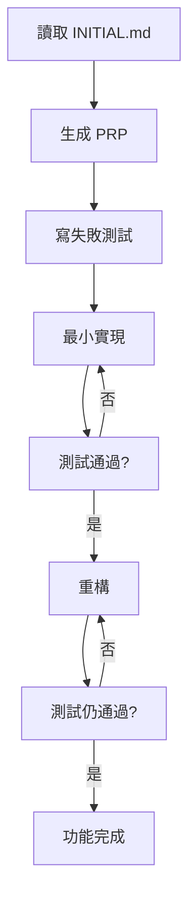

# TDD + Context Engineering 整合指南

> **目標**: 結合 Test-Driven Development 和 Context Engineering 方法論，提供最佳的開發體驗

## 核心概念

### TDD (Test-Driven Development)
**Red → Green → Refactor** 循環：
1. **Red**: 寫失敗測試
2. **Green**: 最小實現讓測試通過
3. **Refactor**: 重構改善代碼品質

### Context Engineering
**10倍效率提升**的 AI 協作方法：
- 使用 Product Requirements Prompt (PRP) 作為完整上下文
- 提供明確的規格和範例
- 確保 AI 生成符合要求的代碼

## 整合工作流程

### 1. 完整的 TDD + Context Engineering 流程



### 2. 實際操作步驟

#### 步驟 1: 生成 PRP
```bash
# 為 INITIAL.md 中的功能生成 PRP
/generate-prp create_new_drawing
```

#### 步驟 2: 執行 TDD 開發
```bash
# 使用 TDD 方法執行 PRP
/execute-prp create_new_drawing
```

這會自動執行：
1. **Red**: 創建失敗測試
2. **Green**: 最小實現
3. **Refactor**: 完整實現

#### 步驟 3: 驗證結果
```bash
# 運行所有測試
python -m pytest tests/unit/test_create_new_drawing.py -v
python -m pytest tests/integration/ -v

# 檢查覆蓋率
python -m pytest --cov=mcp_server_fastmcp --cov-report=term-missing tests/
```

## 實際範例

### 範例: 實現 create_new_drawing 功能

#### 1. 生成 PRP
```bash
/generate-prp create_new_drawing
```

這會創建 `context_engineering/PRPs/create_new_drawing.md` 包含：
- 完整的技術規格
- TDD 測試要求
- 實現範例
- 驗證標準

#### 2. TDD 實現循環

##### Red 階段 (失敗測試)
```python
# tests/unit/test_create_new_drawing.py
import pytest
from unittest.mock import patch, Mock
from mcp_server_fastmcp import create_new_drawing

class TestCreateNewDrawing:
    def test_create_new_drawing_success(self):
        """測試成功創建新圖面"""
        # Arrange
        expected = {
            "status": "success",
            "data": {
                "drawing_name": "新圖面.dwg",
                "template_used": "預設模板"
            }
        }
        
        # Act
        result = create_new_drawing(
            drawing_name="新圖面",
            template_path="",
            units="公制"
        )
        
        # Assert
        assert result == expected
```

##### Green 階段 (最小實現)
```python
# mcp_server_fastmcp.py
@mcp.tool()
def create_new_drawing(
    drawing_name: str = "新圖面",
    template_path: str = "",
    units: str = "公制"
) -> Dict[str, Any]:
    """最小實現 - 僅讓測試通過"""
    return {
        "status": "success",
        "data": {
            "drawing_name": "新圖面.dwg",
            "template_used": "預設模板"
        }
    }
```

##### Refactor 階段 (完整實現)
```python
# mcp_server_fastmcp.py
@mcp.tool()
def create_new_drawing(
    drawing_name: str = "新圖面",
    template_path: str = "",
    units: str = "公制"
) -> Dict[str, Any]:
    """創建新的 AutoCAD 圖面"""
    logger.info(f"create_new_drawing called with: {locals()}")
    
    try:
        # 完整的實現邏輯
        if not self.autocad_util:
            return {
                "status": "error",
                "message": "AutoCAD 連接未建立",
                "error_code": "AUTOCAD_NOT_CONNECTED"
            }
        
        # 實際創建圖面
        result = self.autocad_util.create_new_drawing(
            drawing_name=drawing_name,
            template_path=template_path,
            units=units
        )
        
        return {
            "status": "success",
            "data": result,
            "message": f"成功創建圖面: {drawing_name}"
        }
        
    except Exception as e:
        logger.error(f"Error in create_new_drawing: {e}")
        return {
            "status": "error",
            "message": str(e),
            "error_code": "DRAWING_CREATION_ERROR"
        }
```

## 優勢

### 1. TDD 優勢
- ✅ 確保代碼品質
- ✅ 防止回歸錯誤
- ✅ 提供活文檔
- ✅ 支援安全重構

### 2. Context Engineering 優勢
- ✅ 10倍效率提升
- ✅ 明確的規格定義
- ✅ 一致的代碼模式
- ✅ 完整的上下文

### 3. 組合優勢
- 🚀 **高效開發**: AI 協助 + 品質保證
- 🛡️ **品質保障**: 測試驅動 + 規格明確
- 🔄 **持續改進**: TDD 循環 + PRP 優化
- 📚 **知識傳承**: 測試文檔 + PRP 規格

## 最佳實踐

### 1. PRP 編寫
- 包含完整的 TDD 測試要求
- 提供具體的測試範例
- 定義明確的驗證標準

### 2. 測試編寫
- 先寫失敗測試
- 測試名稱要描述性
- 覆蓋所有錯誤路徑

### 3. 實現方式
- 最小實現先讓測試通過
- 重構時保持測試通過
- 遵循既有的代碼模式

### 4. 品質控制
- 代碼覆蓋率 ≥ 95%
- 所有測試必須通過
- 符合 CLAUDE.md 規範

## 工具配置

### 測試環境
```bash
# 安裝 TDD 工具
pip install pytest pytest-cov pytest-mock pytest-watch

# 持續測試
python -m pytest-watch -- tests/unit/

# 覆蓋率檢查
python -m pytest --cov=mcp_server_fastmcp --cov-report=html tests/
```

### Claude 配置
```json
{
  "rules": [
    "Always follow TDD principles: Red-Green-Refactor",
    "Use Context Engineering PRP as complete context",
    "Ensure 95%+ test coverage for all new code",
    "Write descriptive test names and clear assertions"
  ]
}
```

## 常見問題

### Q: TDD 會拖慢開發速度嗎？
**A**: 短期看似較慢，但長期來看：
- 減少 debug 時間
- 提供重構信心
- 防止回歸錯誤
- 整體效率更高

### Q: Context Engineering 如何與 TDD 結合？
**A**: 
- PRP 定義完整規格（包含測試要求）
- AI 根據 PRP 生成 TDD 測試
- 確保實現符合規格

### Q: 測試覆蓋率真的需要 95% 嗎？
**A**: 是的，因為：
- MCP 工具是系統核心
- 錯誤影響用戶體驗
- 高覆蓋率提供信心

## 總結

**TDD + Context Engineering** 是一個強大的組合：

1. **Context Engineering** 提供明確的規格和上下文
2. **TDD** 確保代碼品質和可維護性
3. **AI 協助** 加速開發過程
4. **測試保障** 確保功能正確性

這個組合完全符合 CLAUDE.md 的開發規範，並能提供最佳的開發體驗。

---

**準備開始？使用以下命令開始第一個功能的開發：**

```bash
# 1. 生成 PRP
/generate-prp create_new_drawing

# 2. 執行 TDD 開發
/execute-prp create_new_drawing
```