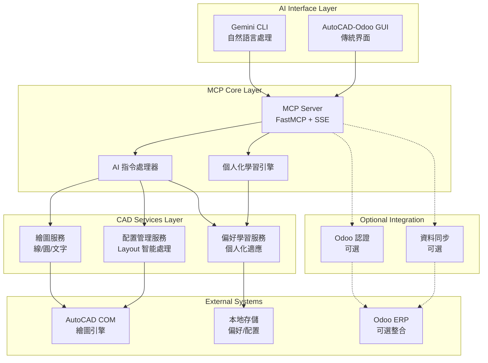
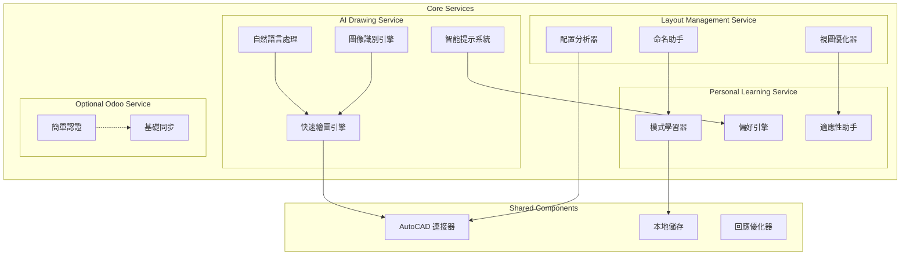
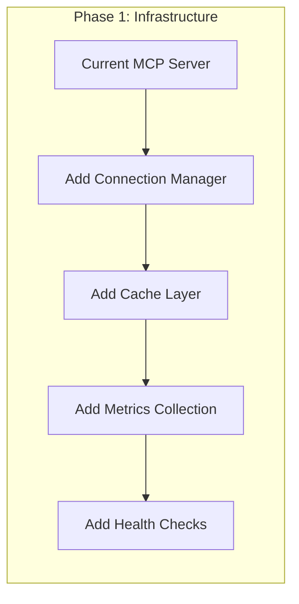
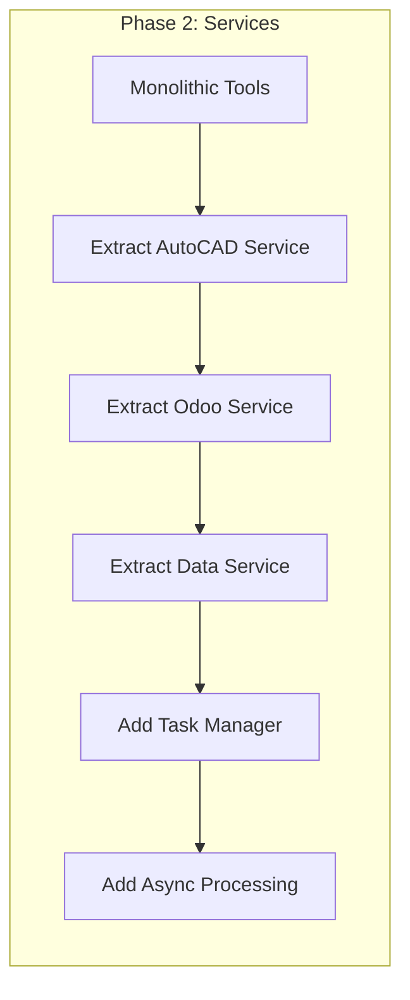
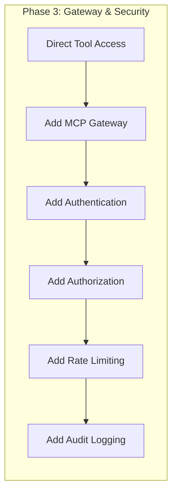

# MCP Server AI 輔助繪圖架構設計

> **文檔版本**: 2.0 (AI 輔助專用版)  
> **設計日期**: 2025年8月5日  
> **架構師**: Winston (System Architect)  
> **基於**: MCP Server v6.0 PRD 修訂版 - AI 輔助 CAD 繪圖專用  
> **目標版本**: v6.0 (AI 輔助 CAD 繪圖版)

## 🎯 架構設計目標

### 核心設計原則 (重新聚焦)
1. **AI 優先** - 專為自然語言指令優化，Gemini CLI 無縫整合
2. **繪圖效率** - 基礎繪圖操作 < 0.5秒，支援即時回饋
3. **個人化適應** - 學習並適應每個 CAD Designer 的工作習慣
4. **配置智能** - 智能管理 AutoCAD 配置 (Layout)，支援任意命名方式
5. **彈性整合** - 可選的 Odoo 認證，不強制使用企業功能

### 解決的核心問題 (重新定義)
- ❌ **手動繪圖耗時** → ✅ 自然語言快速繪圖
- ❌ **配置管理繁瑣** → ✅ AI 智能配置建議
- ❌ **學習門檻高** → ✅ 漸進式智能引導
- ❌ **工作模式固化** → ✅ 個人化學習適應
- ❌ **重複性操作** → ✅ AI 輔助批次處理

---

## 🏗️ AI 輔助繪圖架構

### 簡化架構概覽圖



### 核心組件說明 (AI 輔助專用設計)

#### 1. MCP Server (AI 輔助核心)
**責任**: Gemini CLI 整合，自然語言指令處理，個人化學習
```python
class AIMCPServer:
    """AI 輔助 MCP 伺服器"""
    
    def __init__(self):
        self.gemini_processor = GeminiCommandProcessor()
        self.personal_learning = PersonalLearningEngine()
        self.drawing_service = DrawingService()
        self.layout_service = LayoutService()
        self.preference_service = PreferenceService()
    
    async def process_natural_language_command(
        self, 
        command: str, 
        user_context: UserContext
    ) -> AIResponse:
        """處理自然語言繪圖指令"""
        # 1. 解析自然語言意圖
        intent = await self.gemini_processor.parse_intent(command)
        
        # 2. 個人化指令優化
        personalized_intent = await self.personal_learning.optimize_intent(
            intent, user_context
        )
        
        # 3. 執行繪圖操作
        if personalized_intent.action == "draw":
            result = await self.drawing_service.execute_drawing(
                personalized_intent, user_context
            )
        elif personalized_intent.action == "manage_layout":
            result = await self.layout_service.manage_layout(
                personalized_intent, user_context
            )
        
        # 4. 學習用戶偏好
        await self.personal_learning.learn_from_interaction(
            command, personalized_intent, result, user_context
        )
        
        return AIResponse(result, learning_insights=True)
```

#### 2. 個人化學習引擎 (Personal Learning Engine)
**責任**: 學習用戶習慣，提供個人化建議，適應工作模式
```python
class PersonalLearningEngine:
    """個人化學習引擎"""
    
    def __init__(self):
        self.user_profiles = UserProfileManager()
        self.pattern_analyzer = PatternAnalyzer()
        self.preference_predictor = PreferencePredictor()
    
    async def optimize_intent(
        self, 
        intent: DrawingIntent, 
        user_context: UserContext
    ) -> PersonalizedIntent:
        """基於用戶偏好優化繪圖意圖"""
        
        # 1. 取得用戶偏好檔案
        user_profile = await self.user_profiles.get_profile(user_context.user_id)
        
        # 2. 分析歷史模式
        patterns = await self.pattern_analyzer.analyze_user_patterns(
            user_context.user_id, intent.action_type
        )
        
        # 3. 預測偏好參數
        if intent.has_missing_parameters():
            predicted_params = await self.preference_predictor.predict_parameters(
                intent, user_profile, patterns
            )
            intent.fill_missing_parameters(predicted_params)
        
        # 4. 建議優化選項
        suggestions = await self._generate_suggestions(intent, user_profile)
        
        return PersonalizedIntent(
            original_intent=intent,
            optimized_parameters=intent.parameters,
            user_suggestions=suggestions,
            confidence_score=patterns.confidence
        )
    
    async def learn_from_interaction(
        self,
        original_command: str,
        intent: PersonalizedIntent,
        result: DrawingResult,
        user_context: UserContext
    ):
        """從用戶互動中學習"""
        
        # 1. 記錄成功操作
        if result.success:
            await self.user_profiles.record_successful_pattern(
                user_context.user_id,
                {
                    "command": original_command,
                    "intent": intent,
                    "parameters": intent.optimized_parameters,
                    "timestamp": datetime.now()
                }
            )
        
        # 2. 更新偏好模型
        await self.preference_predictor.update_model(
            user_context.user_id, intent, result
        )
        
        # 3. 分析新模式
        await self.pattern_analyzer.update_patterns(
            user_context.user_id, original_command, intent, result
        )
```

#### 3. 智能配置管理服務 (Layout Service)
**責任**: 管理 AutoCAD 配置，智能建議視圖，支援個人化命名
```python
class LayoutService:
    """智能配置管理服務"""
    
    def __init__(self):
        self.autocad_connector = AutoCADConnector()
        self.layout_analyzer = LayoutAnalyzer()
        self.naming_assistant = NamingAssistant()
        self.view_optimizer = ViewOptimizer()
    
    async def suggest_layouts_for_part(
        self, 
        part_info: PartInfo, 
        user_context: UserContext
    ) -> LayoutSuggestions:
        """為零件建議適合的配置"""
        
        # 1. 分析零件複雜度
        complexity = await self.layout_analyzer.analyze_part_complexity(part_info)
        
        # 2. 基於複雜度建議視圖
        recommended_views = await self._recommend_views(complexity, user_context)
        
        # 3. 建議個人化命名
        naming_suggestions = await self.naming_assistant.suggest_names(
            part_info, recommended_views, user_context
        )
        
        return LayoutSuggestions(
            recommended_views=recommended_views,
            naming_suggestions=naming_suggestions,
            complexity_analysis=complexity,
            confidence_score=complexity.confidence
        )
    
    async def create_layout_set(
        self,
        part_info: PartInfo,
        layout_specs: List[LayoutSpec],
        user_context: UserContext
    ) -> LayoutCreationResult:
        """創建完整的配置集合"""
        
        created_layouts = []
        
        async with self.autocad_connector.get_connection() as conn:
            for spec in layout_specs:
                # 1. 創建配置
                layout_id = await conn.create_layout(spec.name)
                
                # 2. 設置視圖
                await conn.setup_layout_view(
                    layout_id, 
                    spec.view_type, 
                    spec.scale_factor
                )
                
                # 3. 優化視圖設置
                optimized_settings = await self.view_optimizer.optimize_view(
                    spec, part_info, user_context
                )
                await conn.apply_view_settings(layout_id, optimized_settings)
                
                created_layouts.append({
                    "layout_id": layout_id,
                    "name": spec.name,
                    "view_type": spec.view_type,
                    "settings": optimized_settings
                })
        
        return LayoutCreationResult(
            created_layouts=created_layouts,
            part_info=part_info,
            creation_time=datetime.now()
        )
    
    async def get_user_layout_patterns(
        self, 
        user_id: str
    ) -> UserLayoutPatterns:
        """取得用戶的配置使用模式"""
        
        patterns = await self.layout_analyzer.analyze_user_patterns(user_id)
        
        return UserLayoutPatterns(
            preferred_naming_style=patterns.naming_style,
            common_view_combinations=patterns.view_combinations,
            scale_preferences=patterns.scale_preferences,
            layout_organization=patterns.organization_style
        )
```

#### 4. Connection Manager (連線管理器)
**責任**: 連線池管理，健康檢查，故障恢復
```python
class ConnectionManager:
    """統一連線管理器"""
    
    def __init__(self):
        self.autocad_pool = AutoCADConnectionPool(
            min_size=2, max_size=5, timeout=30
        )
        self.odoo_pool = OdooConnectionPool(
            min_size=3, max_size=8, timeout=60
        )
        self.health_monitor = HealthMonitor()
    
    async def get_autocad_connection(self) -> AutoCADConnection:
        """取得 AutoCAD 連線"""
        conn = await self.autocad_pool.acquire()
        
        # 健康檢查
        if not await self.health_monitor.check_autocad_health(conn):
            await self.autocad_pool.invalidate(conn)
            conn = await self.autocad_pool.acquire()
        
        return conn
    
    async def release_autocad_connection(self, conn: AutoCADConnection):
        """釋放 AutoCAD 連線"""
        await self.autocad_pool.release(conn)
    
    @asynccontextmanager
    async def autocad_connection(self):
        """AutoCAD 連線上下文管理器"""
        conn = await self.get_autocad_connection()
        try:
            yield conn
        finally:
            await self.release_autocad_connection(conn)

class AutoCADConnectionPool:
    """AutoCAD 連線池"""
    
    def __init__(self, min_size: int, max_size: int, timeout: int):
        self.min_size = min_size
        self.max_size = max_size
        self.timeout = timeout
        self._pool: asyncio.Queue = asyncio.Queue(maxsize=max_size)
        self._created_connections = 0
        self._lock = asyncio.Lock()
    
    async def acquire(self) -> AutoCADConnection:
        """取得連線"""
        try:
            # 嘗試從池中取得
            conn = await asyncio.wait_for(
                self._pool.get(), timeout=self.timeout
            )
            
            if await self._validate_connection(conn):
                return conn
            else:
                # 連線無效，創建新的
                await self._pool.task_done()
                return await self._create_connection()
                
        except asyncio.TimeoutError:
            # 池已滿且超時，創建臨時連線
            if self._created_connections < self.max_size:
                return await self._create_connection()
            else:
                raise ConnectionPoolExhaustedError()
    
    async def release(self, conn: AutoCADConnection):
        """釋放連線回池"""
        if await self._validate_connection(conn):
            await self._pool.put(conn)
        else:
            # 連線已損壞，不放回池中
            self._created_connections -= 1
    
    async def _create_connection(self) -> AutoCADConnection:
        """創建新連線"""
        async with self._lock:
            if self._created_connections >= self.max_size:
                raise ConnectionPoolExhaustedError()
            
            conn = await AutoCADConnection.create()
            self._created_connections += 1
            return conn
    
    async def _validate_connection(self, conn: AutoCADConnection) -> bool:
        """驗證連線有效性"""
        try:
            return await conn.ping()
        except Exception:
            return False
```

#### 5. Validator Manager (驗證管理器)
**責任**: 統一參數驗證，型別檢查，業務規則驗證
```python
from pydantic import BaseModel, ValidationError
from typing import Dict, Any, Type

class ValidatorManager:
    """統一驗證管理器"""
    
    def __init__(self):
        self.validators: Dict[str, Type[BaseModel]] = {}
        self.i18n = I18nManager()
        self._register_validators()
    
    def _register_validators(self):
        """註冊所有驗證器"""
        self.validators.update({
            "draw_circle": DrawCircleValidator,
            "draw_line": DrawLineValidator,
            "create_text": CreateTextValidator,
            "generate_boq": GenerateBOQValidator,
            # ... 其他工具驗證器
        })
    
    async def validate(self, tool_name: str, arguments: Dict[str, Any]) -> Dict[str, Any]:
        """驗證工具參數"""
        validator_class = self.validators.get(tool_name)
        if not validator_class:
            raise ValidatorNotFoundError(f"No validator for tool: {tool_name}")
        
        try:
            validator = validator_class(**arguments)
            return validator.dict()
        except ValidationError as e:
            # 將 Pydantic 錯誤轉換為國際化訊息
            localized_errors = []
            for error in e.errors():
                field = error["loc"][0] if error["loc"] else "unknown"
                error_type = error["type"]
                error_key = f"{tool_name}.{field}.{error_type}"
                
                localized_message = self.i18n.t(
                    error_key, 
                    default=error["msg"],
                    **error.get("ctx", {})
                )
                
                localized_errors.append({
                    "field": field,
                    "message": localized_message,
                    "error_code": error_type.upper()
                })
            
            raise ValidationError(localized_errors)

# 工具驗證器範例
class DrawCircleValidator(BaseModel):
    """圓形繪製參數驗證器"""
    
    center_point: List[float] = Field(..., min_items=3, max_items=3)
    radius: float = Field(..., gt=0, description="圓形半徑必須大於0")
    layer: str = Field("0", min_length=1, max_length=255)
    
    @validator('center_point')
    def validate_center_point(cls, v):
        if len(v) != 3:
            raise ValueError('center_point_invalid_length')
        
        # 檢查數值範圍 (AutoCAD 座標限制)
        for coord in v:
            if abs(coord) > 1e6:
                raise ValueError('coordinate_out_of_range')
        
        return v
    
    @validator('layer')
    def validate_layer_name(cls, v):
        # AutoCAD 圖層名稱規則
        invalid_chars = '<>/\":;?*|,=`'
        if any(char in v for char in invalid_chars):
            raise ValueError('layer_name_invalid_chars')
        
        return v.strip()

class GenerateBOQValidator(BaseModel):
    """BOQ 生成參數驗證器"""
    
    drawing_name: str = Field(..., min_length=1, max_length=255)
    project_id: Optional[int] = Field(None, gt=0)
    include_autocad_data: bool = Field(True)
    calculation_rules: Optional[Dict[str, Any]] = Field(None)
    element_types: Optional[List[str]] = Field(None)
    layer_filter: Optional[str] = Field(None)
    output_format: str = Field("odoo", regex="^(odoo|excel|json)$")
    currency: str = Field("TWD", regex="^(TWD|USD|EUR|JPY|CNY)$")
    
    @validator('drawing_name')
    def validate_drawing_name(cls, v):
        # 檔案名稱安全檢查
        invalid_chars = '<>/\":*?|'
        if any(char in v for char in invalid_chars):
            raise ValueError('drawing_name_invalid_chars')
        
        return v.strip()
    
    @validator('element_types')
    def validate_element_types(cls, v):
        if v is not None:
            valid_types = ["line", "circle", "arc", "text", "dimension", "block"]
            invalid_types = [t for t in v if t not in valid_types]
            if invalid_types:
                raise ValueError(f'invalid_element_types: {invalid_types}')
        
        return v
```

---

## 🛠️ AI 輔助繪圖服務層

### 簡化服務架構



### AI 輔助服務類

```python
from abc import ABC, abstractmethod
from typing import Dict, Any, Optional, List
import asyncio
import logging
from contextlib import asynccontextmanager

class AIDrawingService:
    """AI 輔助繪圖服務 (包含圖像識別功能)"""
    
    def __init__(self):
        self.autocad_connector = AutoCADConnector()
        self.nlp_processor = NaturalLanguageProcessor()
        self.image_recognizer = ImageRecognitionEngine()
        self.drawing_optimizer = DrawingOptimizer()
        self.response_formatter = ResponseFormatter()
    
    async def process_drawing_command(
        self, 
        natural_command: str,
        user_context: UserContext
    ) -> DrawingResponse:
        """處理自然語言繪圖指令"""
        start_time = time.time()
        
        try:
            # 1. 解析自然語言意圖
            intent = await self.nlp_processor.parse_drawing_intent(natural_command)
            
            # 2. 優化繪圖參數
            optimized_params = await self.drawing_optimizer.optimize_parameters(
                intent, user_context
            )
            
            # 3. 執行繪圖操作
            async with self.autocad_connector.get_connection() as conn:
                drawing_result = await self._execute_drawing_operation(
                    conn, intent.action, optimized_params
                )
            
            # 4. 格式化回應
            execution_time = time.time() - start_time
            
            return DrawingResponse(
                success=True,
                drawing_result=drawing_result,
                execution_time=execution_time,
                user_message=f"成功{intent.action_description}",
                ai_insights=await self._generate_insights(intent, drawing_result)
            )
            
        except Exception as e:
            execution_time = time.time() - start_time
            
            return DrawingResponse(
                success=False,
                error=str(e),
                execution_time=execution_time,
                user_message=f"繪圖操作失敗: {str(e)}",
                suggestions=await self._generate_error_suggestions(natural_command, e)
            )
    
    async def _execute_drawing_operation(
        self, 
        conn: AutoCADConnection,
        action: str,
        params: Dict[str, Any]
    ) -> Dict[str, Any]:
        """執行具體的繪圖操作"""
        
        if action == "draw_circle":
            circle_id = await conn.draw_circle(
                center=params["center"], 
                radius=params["radius"],
                layer=params.get("layer", "0")
            )
            
            return {
                "element_id": circle_id,
                "element_type": "circle",
                "properties": {
                    "center": params["center"],
                    "radius": params["radius"],
                    "area": math.pi * params["radius"] ** 2,
                    "circumference": 2 * math.pi * params["radius"]
                }
            }
            
        elif action == "draw_line":
            line_id = await conn.draw_line(
                start=params["start_point"],
                end=params["end_point"],
                layer=params.get("layer", "0")
            )
            
            # 計算線段長度
            length = math.sqrt(
                sum((params["end_point"][i] - params["start_point"][i]) ** 2 
                    for i in range(3))
            )
            
            return {
                "element_id": line_id,
                "element_type": "line",
                "properties": {
                    "start_point": params["start_point"],
                    "end_point": params["end_point"],
                    "length": length
                }
            }
            
        elif action == "create_text":
            text_id = await conn.create_text(
                position=params["position"],
                text=params["text_content"],
                height=params.get("height", 2.5),
                layer=params.get("layer", "0")
            )
            
            return {
                "element_id": text_id,
                "element_type": "text",
                "properties": {
                    "position": params["position"],
                    "text_content": params["text_content"],
                    "height": params.get("height", 2.5)
                }
            }
    
    async def _generate_insights(
        self, 
        intent: DrawingIntent, 
        result: Dict[str, Any]
    ) -> List[str]:
        """生成 AI 見解和建議"""
        insights = []
        
        if intent.action == "draw_circle":
            radius = result["properties"]["radius"]  
            if radius > 100:
                insights.append("這是一個大型圓形，建議檢查比例設定")
            elif radius < 1:
                insights.append("這是一個小型圓形，可能需要放大視圖來查看細節")
        
        elif intent.action == "draw_line":
            length = result["properties"]["length"]
            if length > 1000:
                insights.append("這是一條長線段，建議使用適當的圖層組織")
        
        return insights
    
    async def _generate_error_suggestions(
        self, 
        command: str, 
        error: Exception
    ) -> List[str]:
        """生成錯誤修正建議"""
        suggestions = []
        
        if "radius" in str(error).lower():
            suggestions.append("請確認圓形半徑為正數")
            suggestions.append("範例：畫一個半徑10的圓形")
        elif "point" in str(error).lower():
            suggestions.append("請確認座標點格式正確")
            suggestions.append("範例：從 (0,0) 到 (10,10) 畫線")
        
        return suggestions
    
    async def process_image_to_drawing(
        self,
        image_file: bytes,
        file_type: str,  # pdf, png, gif, jpg
        user_context: UserContext,
        processing_options: Optional[Dict[str, Any]] = None
    ) -> ImageDrawingResponse:
        """處理圖像文件並自動生成 AutoCAD 繪圖"""
        start_time = time.time()
        
        try:
            # 1. 圖像預處理和格式轉換
            processed_image = await self.image_recognizer.preprocess_image(
                image_file, file_type
            )
            
            # 2. 識別圖像中的幾何元素
            recognized_elements = await self.image_recognizer.recognize_geometry(
                processed_image, processing_options
            )
            
            # 3. 轉換為 AutoCAD 指令
            drawing_commands = await self.image_recognizer.convert_to_cad_commands(
                recognized_elements, user_context
            )
            
            # 4. 執行批次繪圖操作
            results = []
            async with self.autocad_connector.get_connection() as conn:
                for command in drawing_commands:
                    try:
                        result = await self._execute_drawing_operation(
                            conn, command.action, command.parameters
                        )
                        results.append(result)
                    except Exception as e:
                        # 記錄個別命令失敗，但繼續處理其他命令
                        results.append({
                            "error": str(e),
                            "command": command.action,
                            "parameters": command.parameters
                        })
            
            execution_time = time.time() - start_time
            successful_elements = [r for r in results if "error" not in r]
            failed_elements = [r for r in results if "error" in r]
            
            return ImageDrawingResponse(
                success=len(successful_elements) > 0,
                recognized_elements_count=len(recognized_elements),
                successful_drawings=successful_elements,
                failed_drawings=failed_elements,
                execution_time=execution_time,
                user_message=f"成功識別 {len(recognized_elements)} 個元素，繪製 {len(successful_elements)} 個",
                processing_summary={
                    "image_type": file_type,
                    "recognition_confidence": recognized_elements.confidence if hasattr(recognized_elements, 'confidence') else 0.8,
                    "processing_options": processing_options
                }
            )
            
        except Exception as e:
            execution_time = time.time() - start_time
            
            return ImageDrawingResponse(
                success=False,
                error=str(e),
                execution_time=execution_time,
                user_message=f"圖像處理失敗: {str(e)}",
                suggestions=[
                    "請確認圖像文件格式正確 (支援 PDF, PNG, JPG, GIF)",
                    "建議使用高解析度、對比度清晰的圖像",
                    "複雜圖像可能需要手動調整識別參數"
                ]
            )

class ImageRecognitionEngine:
    """圖像識別引擎"""
    
    def __init__(self):
        self.cv_processor = OpenCVProcessor()
        self.ai_recognizer = AIGeometryRecognizer()  # 可使用 YOLO, TensorFlow, PyTorch
        self.pdf_processor = PDFProcessor()
        self.cad_converter = CADCommandConverter()
    
    async def preprocess_image(
        self, 
        image_data: bytes, 
        file_type: str
    ) -> ProcessedImage:
        """圖像預處理"""
        
        if file_type.lower() == 'pdf':
            # PDF 轉換為圖像
            images = await self.pdf_processor.extract_images(image_data)
            # 選擇第一頁或合併多頁
            processed_image = images[0] if images else None
        else:
            # 直接處理圖像文件
            processed_image = await self.cv_processor.load_image(image_data)
        
        if processed_image is None:
            raise ValueError(f"無法處理 {file_type} 格式的圖像")
        
        # 圖像增強處理
        enhanced_image = await self.cv_processor.enhance_image(processed_image)
        
        return ProcessedImage(
            original=processed_image,
            enhanced=enhanced_image,
            metadata={"file_type": file_type, "size": processed_image.shape}
        )
    
    async def recognize_geometry(
        self, 
        image: ProcessedImage,
        options: Optional[Dict[str, Any]] = None
    ) -> RecognizedElements:
        """識別幾何元素"""
        
        # 使用 OpenCV 進行基礎幾何識別
        cv_results = await self.cv_processor.detect_shapes(
            image.enhanced, 
            options.get('cv_settings', {}) if options else {}
        )
        
        # 使用 AI 模型進行進階識別（可選）
        if options and options.get('use_ai_recognition', True):
            ai_results = await self.ai_recognizer.detect_geometry(
                image.enhanced,
                options.get('ai_settings', {})
            )
            
            # 合併和驗證結果
            combined_results = await self._merge_recognition_results(cv_results, ai_results)
        else:
            combined_results = cv_results
        
        return RecognizedElements(
            circles=combined_results.circles,
            lines=combined_results.lines,
            rectangles=combined_results.rectangles,
            text=combined_results.text,
            complex_shapes=combined_results.complex_shapes,
            confidence=combined_results.overall_confidence
        )
    
    async def convert_to_cad_commands(
        self, 
        elements: RecognizedElements,
        user_context: UserContext
    ) -> List[CADCommand]:
        """轉換為 CAD 繪圖指令"""
        
        commands = []
        
        # 處理圓形
        for circle in elements.circles:
            commands.append(CADCommand(
                action="draw_circle",
                parameters={
                    "center": [circle.center_x, circle.center_y, 0.0],
                    "radius": circle.radius,
                    "layer": f"Recognized_Circles"
                }
            ))
        
        # 處理線段
        for line in elements.lines:
            commands.append(CADCommand(
                action="draw_line",
                parameters={
                    "start_point": [line.start_x, line.start_y, 0.0],
                    "end_point": [line.end_x, line.end_y, 0.0],
                    "layer": f"Recognized_Lines"
                }
            ))
        
        # 處理矩形（轉換為4條線段）
        for rect in elements.rectangles:
            rect_commands = self._rectangle_to_lines(rect)
            commands.extend(rect_commands)
        
        # 處理文字
        for text_elem in elements.text:
            commands.append(CADCommand(
                action="create_text",
                parameters={
                    "position": [text_elem.x, text_elem.y, 0.0],
                    "text_content": text_elem.content,
                    "height": text_elem.height or 2.5,
                    "layer": f"Recognized_Text"
                }
            ))
        
        return commands
    
    def _rectangle_to_lines(self, rect) -> List[CADCommand]:
        """將矩形轉換為線段組合"""
        return [
            CADCommand("draw_line", {
                "start_point": [rect.x, rect.y, 0.0],
                "end_point": [rect.x + rect.width, rect.y, 0.0],
                "layer": "Recognized_Rectangles"
            }),
            CADCommand("draw_line", {
                "start_point": [rect.x + rect.width, rect.y, 0.0],
                "end_point": [rect.x + rect.width, rect.y + rect.height, 0.0],
                "layer": "Recognized_Rectangles"
            }),
            CADCommand("draw_line", {
                "start_point": [rect.x + rect.width, rect.y + rect.height, 0.0],
                "end_point": [rect.x, rect.y + rect.height, 0.0],
                "layer": "Recognized_Rectangles"
            }),
            CADCommand("draw_line", {
                "start_point": [rect.x, rect.y + rect.height, 0.0],
                "end_point": [rect.x, rect.y, 0.0],
                "layer": "Recognized_Rectangles"
            })
        ]

class AutoCADService(BaseToolService):
    """AutoCAD 工具服務"""
    
    def __init__(self, connection_manager: ConnectionManager):
        super().__init__("autocad", connection_manager)
        self.tool_handlers = {
            "create_new_drawing": self._create_new_drawing,
            "draw_line": self._draw_line,
            "draw_circle": self._draw_circle,
            "create_text": self._create_text,
            "add_dimension": self._add_dimension,
            "set_layer": self._set_layer,
            "list_layers": self._list_layers,
            "scan_elements": self._scan_elements,
            "extract_autocad_parameters": self._extract_parameters
        }
    
    async def initialize(self) -> bool:
        """初始化 AutoCAD 服務"""
        try:
            # 測試 AutoCAD 連線
            async with self.connection_manager.autocad_connection() as conn:
                await conn.ping()
            
            self.logger.info("AutoCAD service initialized successfully")
            return True
        except Exception as e:
            self.logger.error(f"Failed to initialize AutoCAD service: {e}")
            return False
    
    async def health_check(self) -> Dict[str, Any]:
        """AutoCAD 服務健康檢查"""
        try:
            async with self.connection_manager.autocad_connection() as conn:
                app_info = await conn.get_application_info()
                
                return {
                    "status": "healthy",
                    "connected": True,
                    "application_info": app_info,
                    "pool_stats": await self.connection_manager.autocad_pool.get_stats()
                }
        except Exception as e:
            return {
                "status": "unhealthy",
                "connected": False,
                "error": str(e)
            }
    
    async def _execute_tool_impl(
        self, 
        tool_name: str, 
        arguments: Dict[str, Any],
        context: UserContext
    ) -> Any:
        """執行 AutoCAD 工具"""
        handler = self.tool_handlers.get(tool_name)
        if not handler:
            raise ToolNotFoundError(f"AutoCAD tool not found: {tool_name}")
        
        return await handler(arguments, context)
    
    async def _draw_circle(self, arguments: Dict[str, Any], context: UserContext) -> Dict[str, Any]:
        """繪製圓形實作"""
        center_point = arguments["center_point"]
        radius = arguments["radius"]
        layer = arguments.get("layer", "0")
        
        async with self.connection_manager.autocad_connection() as conn:
            circle_id = await conn.draw_circle(center_point, radius, layer)
            
            # 計算圓形屬性
            area = math.pi * radius * radius
            circumference = 2 * math.pi * radius
            
            return {
                "status": "success",
                "data": {
                    "circle_id": circle_id,
                    "center_point": center_point,
                    "radius": radius,
                    "layer": layer,
                    "area": round(area, 2),
                    "circumference": round(circumference, 2),
                    "created_at": datetime.now().isoformat()
                },
                "message": f"成功繪製圓形，半徑: {radius}",
                "timestamp": datetime.now().isoformat()
            }
    
    async def _scan_elements(self, arguments: Dict[str, Any], context: UserContext) -> Dict[str, Any]:
        """掃描元素實作"""
        element_type = arguments.get("element_type", "all")
        include_geometry = arguments.get("include_geometry", True)
        include_properties = arguments.get("include_properties", True)
        layer_filter = arguments.get("layer_filter")
        bounds = arguments.get("bounds")
        
        async with self.connection_manager.autocad_connection() as conn:
            elements = await conn.scan_elements(
                element_type=element_type,
                include_geometry=include_geometry,
                include_properties=include_properties,
                layer_filter=layer_filter,
                bounds=bounds
            )
            
            # 統計分析
            summary = {
                "total_count": len(elements),
                "by_type": {},
                "by_layer": {}
            }
            
            for element in elements:
                elem_type = element.get("type", "unknown")
                elem_layer = element.get("layer", "0")
                
                summary["by_type"][elem_type] = summary["by_type"].get(elem_type, 0) + 1
                summary["by_layer"][elem_layer] = summary["by_layer"].get(elem_layer, 0) + 1
            
            return {
                "status": "success",
                "data": {
                    "elements": elements,
                    "summary": summary,
                    "scan_settings": {
                        "element_type": element_type,
                        "include_geometry": include_geometry,
                        "include_properties": include_properties,
                        "layer_filter": layer_filter,
                        "bounds": bounds
                    },
                    "scanned_at": datetime.now().isoformat()
                },
                "message": f"成功掃描 {summary['total_count']} 個圖面元素",
                "timestamp": datetime.now().isoformat()
            }

class OdooService(BaseToolService):
    """Odoo 工具服務"""
    
    def __init__(self, connection_manager: ConnectionManager):
        super().__init__("odoo", connection_manager)
        self.tool_handlers = {
            "check_odoo_status": self._check_status,
            "sync_to_odoo": self._sync_to_odoo,
            "generate_boq": self._generate_boq,
            "generate_boq_from_drawing": self._generate_boq_from_drawing,
            "sync_drawing_to_odoo": self._sync_drawing_to_odoo
        }
    
    async def initialize(self) -> bool:
        """初始化 Odoo 服務"""
        try:
            async with self.connection_manager.odoo_connection() as conn:
                await conn.test_connection()
            
            self.logger.info("Odoo service initialized successfully")
            return True
        except Exception as e:
            self.logger.error(f"Failed to initialize Odoo service: {e}")
            return False
    
    async def health_check(self) -> Dict[str, Any]:
        """Odoo 服務健康檢查"""
        try:
            async with self.connection_manager.odoo_connection() as conn:
                server_info = await conn.get_server_info()
                
                return {
                    "status": "healthy",
                    "connected": True,
                    "server_info": server_info,
                    "pool_stats": await self.connection_manager.odoo_pool.get_stats()
                }
        except Exception as e:
            return {
                "status": "unhealthy",
                "connected": False,
                "error": str(e)
            }
    
    async def _execute_tool_impl(
        self, 
        tool_name: str, 
        arguments: Dict[str, Any],
        context: UserContext
    ) -> Any:
        """執行 Odoo 工具"""
        handler = self.tool_handlers.get(tool_name)
        if not handler:
            raise ToolNotFoundError(f"Odoo tool not found: {tool_name}")
        
        return await handler(arguments, context)
    
    async def _generate_boq_from_drawing(
        self, 
        arguments: Dict[str, Any], 
        context: UserContext
    ) -> Dict[str, Any]:
        """從圖面生成 BOQ 實作"""
        drawing_name = arguments["drawing_name"]
        project_id = arguments.get("project_id")
        include_autocad_data = arguments.get("include_autocad_data", True)
        calculation_rules = arguments.get("calculation_rules")
        element_types = arguments.get("element_types")
        layer_filter = arguments.get("layer_filter")
        output_format = arguments.get("output_format", "odoo")
        currency = arguments.get("currency", "TWD")
        
        # 使用其他服務來取得資料
        autocad_service = ServiceRegistry.get_service("autocad")
        
        # 1. 掃描 AutoCAD 元素
        if include_autocad_data:
            scan_result = await autocad_service.execute_tool(
                "scan_elements",
                {
                    "element_type": "all",
                    "include_geometry": True,
                    "include_properties": True,
                    "layer_filter": layer_filter
                },
                context
            )
            elements = scan_result["data"]["elements"]
        else:
            elements = []
        
        # 2. 連接 Odoo 並生成 BOQ
        async with self.connection_manager.odoo_connection() as conn:
            # 取得專案資訊
            if project_id:
                project_info = await conn.get_project(project_id)
            else:
                project_info = {"name": drawing_name, "id": None}
            
            # 生成 BOQ 項目
            boq_items = []
            total_amount = 0.0
            matched_products = 0
            
            for i, element in enumerate(elements):
                # 嘗試匹配 Odoo 產品
                product = await conn.get_product_by_name(element.get("layer", "unknown"))
                
                if product:
                    matched_products += 1
                    unit_price = product.get("list_price", 0.0)
                    unit = product.get("uom_name", "pcs")
                    odoo_product_id = product.get("id")
                else:
                    unit_price = 0.0
                    unit = "pcs"
                    odoo_product_id = None
                
                # 計算數量（基於元素類型和幾何資訊）
                quantity = await self._calculate_quantity(element, calculation_rules)
                
                total_price = quantity * unit_price
                total_amount += total_price
                
                boq_item = {
                    "item_id": f"BOQ_{i+1:03d}",
                    "description": element.get("layer", "unknown"),
                    "unit": unit,
                    "quantity": quantity,
                    "unit_price": unit_price,
                    "total_price": total_price,
                    "odoo_product_id": odoo_product_id,
                    "autocad_element": element if include_autocad_data else None
                }
                
                boq_items.append(boq_item)
            
            # 如果有 project_id，將 BOQ 保存到 Odoo
            boq_id = None
            if project_id and output_format == "odoo":
                boq_id = await conn.create_boq(project_id, boq_items)
            
            return {
                "status": "success",
                "data": {
                    "boq_info": {
                        "drawing_name": drawing_name,
                        "project_id": project_id,
                        "project_info": project_info,
                        "currency": currency,
                        "generated_at": datetime.now().isoformat()
                    },
                    "boq_summary": {
                        "total_items": len(boq_items),
                        "total_amount": total_amount,
                        "matched_products": matched_products,
                        "unmatched_elements": len(elements) - matched_products
                    },
                    "boq_items": boq_items,
                    "odoo_integration": {
                        "boq_id": boq_id,
                        "project_url": f"{conn.base_url}/project/{project_id}" if project_id else None
                    }
                },
                "message": f"成功生成BOQ: {len(boq_items)} 項，總金額 ${total_amount:,.2f}",
                "timestamp": datetime.now().isoformat()
            }
    
    async def _calculate_quantity(
        self, 
        element: Dict[str, Any], 
        calculation_rules: Optional[Dict[str, Any]]
    ) -> float:
        """根據元素類型和計算規則計算數量"""
        element_type = element.get("type", "unknown")
        
        if calculation_rules and element_type in calculation_rules:
            # 使用自定義計算規則
            rule = calculation_rules[element_type]
            if rule == "count":
                return 1.0
            elif rule == "length" and "length" in element:
                return element["length"]
            elif rule == "area" and "area" in element:
                return element["area"]
            elif rule == "volume" and "volume" in element:
                return element["volume"]
        
        # 預設計算邏輯
        if element_type == "line" and "length" in element:
            return element["length"]
        elif element_type == "circle" and "area" in element:
            return element["area"]
        elif element_type in ["text", "dimension", "block"]:
            return 1.0
        else:
            return 1.0
```

---

## 🔧 基礎設施層設計

### 快取與任務佇列

```python
import aioredis
from typing import Any, Optional, Dict
import json
import pickle
import asyncio
from datetime import datetime, timedelta

class CacheManager:
    """Redis 快取管理器"""
    
    def __init__(self, redis_url: str = "redis://localhost:6379"):
        self.redis_url = redis_url
        self.redis: Optional[aioredis.Redis] = None
    
    async def initialize(self):
        """初始化 Redis 連線"""
        self.redis = aioredis.from_url(self.redis_url)
        await self.redis.ping()
    
    async def get(self, key: str) -> Optional[Any]:
        """取得快取值"""
        if not self.redis:
            return None
        
        try:
            value = await self.redis.get(key)
            if value:
                return pickle.loads(value)
        except Exception as e:
            logger.error(f"Cache get error: {e}")
        
        return None
    
    async def set(
        self, 
        key: str, 
        value: Any, 
        expire_seconds: Optional[int] = None
    ):
        """設定快取值"""
        if not self.redis:
            return
        
        try:
            serialized_value = pickle.dumps(value)
            await self.redis.set(key, serialized_value, ex=expire_seconds)
        except Exception as e:
            logger.error(f"Cache set error: {e}")
    
    async def delete(self, key: str):
        """刪除快取值"""
        if not self.redis:
            return
        
        try:
            await self.redis.delete(key)
        except Exception as e:
            logger.error(f"Cache delete error: {e}")
    
    async def exists(self, key: str) -> bool:
        """檢查鍵是否存在"""
        if not self.redis:
            return False
        
        try:
            return await self.redis.exists(key) > 0
        except Exception as e:
            logger.error(f"Cache exists error: {e}")
            return False

class TaskQueue:
    """Redis 任務佇列"""
    
    def __init__(self, redis_url: str = "redis://localhost:6379"):
        self.redis_url = redis_url
        self.redis: Optional[aioredis.Redis] = None
        self.queue_name = "mcp_tasks"
    
    async def initialize(self):
        """初始化 Redis 連線"""
        self.redis = aioredis.from_url(self.redis_url)
        await self.redis.ping()
    
    async def enqueue(self, task: Dict[str, Any]) -> str:
        """將任務加入佇列"""
        if not self.redis:
            raise RuntimeError("TaskQueue not initialized")
        
        task_data = {
            "id": task["id"],
            "tool_name": task["tool_name"],
            "arguments": task["arguments"],
            "user_context": task["user_context"],
            "created_at": datetime.now().isoformat(),
            "priority": task.get("priority", 5)  # 1-10, 1 為最高優先級
        }
        
        # 使用有序集合實現優先級佇列
        await self.redis.zadd(
            self.queue_name, 
            {json.dumps(task_data): task_data["priority"]}
        )
        
        return task["id"]
    
    async def dequeue(self) -> Optional[Dict[str, Any]]:
        """從佇列取出任務"""
        if not self.redis:
            return None
        
        # 取出優先級最高的任務
        result = await self.redis.bzpopmin(self.queue_name, timeout=1)
        if result:
            queue_name, task_json, score = result
            return json.loads(task_json)
        
        return None
    
    async def get_queue_size(self) -> int:
        """取得佇列大小"""
        if not self.redis:
            return 0
        
        return await self.redis.zcard(self.queue_name)

class MetricsStore:
    """指標存儲"""
    
    def __init__(self, redis_url: str = "redis://localhost:6379"):
        self.redis_url = redis_url
        self.redis: Optional[aioredis.Redis] = None
    
    async def initialize(self):
        """初始化 Redis 連線"""
        self.redis = aioredis.from_url(self.redis_url)
        await self.redis.ping()
    
    async def record_tool_execution(
        self,
        tool_name: str,
        execution_time: float,
        success: bool,
        user_id: str
    ):
        """記錄工具執行指標"""
        if not self.redis:
            return
        
        timestamp = int(datetime.now().timestamp())
        date_key = datetime.now().strftime("%Y-%m-%d")
        
        # 工具執行次數
        await self.redis.hincrby(f"tool_calls:{date_key}", tool_name, 1)
        
        # 成功/失敗次數
        status = "success" if success else "error"
        await self.redis.hincrby(f"tool_status:{date_key}", f"{tool_name}:{status}", 1)
        
        # 執行時間（使用時間序列）
        await self.redis.zadd(
            f"tool_duration:{tool_name}:{date_key}",
            {f"{timestamp}:{user_id}": execution_time}
        )
        
        # 用戶使用統計
        await self.redis.hincrby(f"user_usage:{date_key}", user_id, 1)
    
    async def get_tool_metrics(
        self, 
        tool_name: str, 
        days: int = 7
    ) -> Dict[str, Any]:
        """取得工具指標"""
        if not self.redis:
            return {}
        
        metrics = {
            "tool_name": tool_name,
            "period_days": days,
            "total_calls": 0,
            "success_calls": 0,
            "error_calls": 0,
            "average_duration": 0.0,
            "daily_stats": []
        }
        
        end_date = datetime.now()
        
        for i in range(days):
            date = end_date - timedelta(days=i)
            date_key = date.strftime("%Y-%m-%d")
            
            # 當日執行次數
            calls = await self.redis.hget(f"tool_calls:{date_key}", tool_name) or 0
            calls = int(calls)
            
            # 成功/失敗次數
            success = await self.redis.hget(f"tool_status:{date_key}", f"{tool_name}:success") or 0
            error = await self.redis.hget(f"tool_status:{date_key}", f"{tool_name}:error") or 0
            success, error = int(success), int(error)
            
            # 平均執行時間
            durations = await self.redis.zrange(f"tool_duration:{tool_name}:{date_key}", 0, -1, withscores=True)
            avg_duration = sum(score for _, score in durations) / len(durations) if durations else 0
            
            daily_stat = {
                "date": date_key,
                "calls": calls,
                "success": success,
                "error": error,
                "average_duration": round(avg_duration, 3)
            }
            
            metrics["daily_stats"].append(daily_stat)
            metrics["total_calls"] += calls
            metrics["success_calls"] += success
            metrics["error_calls"] += error
        
        # 計算整體平均執行時間
        if metrics["total_calls"] > 0:
            total_duration = sum(stat["average_duration"] * stat["calls"] for stat in metrics["daily_stats"])
            metrics["average_duration"] = round(total_duration / metrics["total_calls"], 3)
        
        return metrics
```

### 可觀測性系統

```python
import asyncio
import time
from typing import Dict, Any, List, Optional
from dataclasses import dataclass
from enum import Enum
import json

class AlertLevel(Enum):
    INFO = "info"
    WARNING = "warning"
    ERROR = "error"
    CRITICAL = "critical"

@dataclass
class Alert:
    level: AlertLevel
    component: str
    message: str
    metadata: Dict[str, Any]
    timestamp: float
    resolved: bool = False

class MonitoringSystem:
    """系統監控和告警"""
    
    def __init__(self):
        self.alerts: List[Alert] = []
        self.thresholds = {
            "response_time": 5.0,  # 秒
            "error_rate": 0.05,    # 5%
            "memory_usage": 0.85,  # 85%
            "cpu_usage": 0.80,     # 80%
            "connection_pool_usage": 0.90  # 90%
        }
        self.metrics_collector = MetricsCollector()
    
    async def start_monitoring(self):
        """開始監控"""
        asyncio.create_task(self._monitor_system_health())
        asyncio.create_task(self._monitor_tool_performance())
        asyncio.create_task(self._monitor_connection_pools())
    
    async def _monitor_system_health(self):
        """監控系統健康狀況"""
        while True:
            try:
                # 檢查記憶體使用量
                memory_usage = await self._get_memory_usage()
                if memory_usage > self.thresholds["memory_usage"]:
                    await self._create_alert(
                        AlertLevel.WARNING,
                        "system",
                        f"High memory usage: {memory_usage:.1%}",
                        {"memory_usage": memory_usage}
                    )
                
                # 檢查 CPU 使用量
                cpu_usage = await self._get_cpu_usage()
                if cpu_usage > self.thresholds["cpu_usage"]:
                    await self._create_alert(
                        AlertLevel.WARNING,
                        "system",
                        f"High CPU usage: {cpu_usage:.1%}",
                        {"cpu_usage": cpu_usage}
                    )
                
                await asyncio.sleep(30)  # 每30秒檢查一次
                
            except Exception as e:
                logger.error(f"System health monitoring error: {e}")
                await asyncio.sleep(60)
    
    async def _monitor_tool_performance(self):
        """監控工具效能"""
        while True:
            try:
                # 取得最近1小時的工具指標
                metrics = await self.metrics_collector.get_recent_metrics(hours=1)
                
                for tool_name, stats in metrics.items():
                    # 檢查回應時間
                    if stats["avg_response_time"] > self.thresholds["response_time"]:
                        await self._create_alert(
                            AlertLevel.WARNING,
                            "performance",
                            f"Slow tool response: {tool_name} ({stats['avg_response_time']:.2f}s)",
                            {"tool_name": tool_name, "response_time": stats["avg_response_time"]}
                        )
                    
                    # 檢查錯誤率
                    error_rate = stats["error_count"] / stats["total_count"] if stats["total_count"] > 0 else 0
                    if error_rate > self.thresholds["error_rate"]:
                        await self._create_alert(
                            AlertLevel.ERROR,
                            "reliability",
                            f"High error rate: {tool_name} ({error_rate:.1%})",
                            {"tool_name": tool_name, "error_rate": error_rate}
                        )
                
                await asyncio.sleep(300)  # 每5分鐘檢查一次
                
            except Exception as e:
                logger.error(f"Tool performance monitoring error: {e}")
                await asyncio.sleep(300)
    
    async def _monitor_connection_pools(self):
        """監控連線池狀況"""
        while True:
            try:
                # 檢查 AutoCAD 連線池
                autocad_stats = await connection_manager.autocad_pool.get_stats()
                autocad_usage = autocad_stats["active"] / autocad_stats["max_size"]
                
                if autocad_usage > self.thresholds["connection_pool_usage"]:
                    await self._create_alert(
                        AlertLevel.WARNING,
                        "connection_pool",
                        f"AutoCAD connection pool near capacity: {autocad_usage:.1%}",
                        {"pool": "autocad", "usage": autocad_usage}
                    )
                
                # 檢查 Odoo 連線池
                odoo_stats = await connection_manager.odoo_pool.get_stats()
                odoo_usage = odoo_stats["active"] / odoo_stats["max_size"]
                
                if odoo_usage > self.thresholds["connection_pool_usage"]:
                    await self._create_alert(
                        AlertLevel.WARNING,
                        "connection_pool",
                        f"Odoo connection pool near capacity: {odoo_usage:.1%}",
                        {"pool": "odoo", "usage": odoo_usage}
                    )
                
                await asyncio.sleep(60)  # 每分鐘檢查一次
                
            except Exception as e:
                logger.error(f"Connection pool monitoring error: {e}")
                await asyncio.sleep(60)
    
    async def _create_alert(
        self, 
        level: AlertLevel, 
        component: str, 
        message: str, 
        metadata: Dict[str, Any]
    ):
        """創建告警"""
        alert = Alert(
            level=level,
            component=component,
            message=message,
            metadata=metadata,
            timestamp=time.time()
        )
        
        self.alerts.append(alert)
        
        # 記錄到日誌
        log_level = {
            AlertLevel.INFO: logger.info,
            AlertLevel.WARNING: logger.warning,
            AlertLevel.ERROR: logger.error,
            AlertLevel.CRITICAL: logger.critical
        }[level]
        
        log_level(f"[ALERT] {component}: {message}", extra=metadata)
        
        # 如果是嚴重告警，發送通知
        if level in [AlertLevel.ERROR, AlertLevel.CRITICAL]:
            await self._send_notification(alert)
    
    async def _send_notification(self, alert: Alert):
        """發送告警通知"""
        # 這裡可以整合 Slack, Email, SMS 等通知系統
        notification_payload = {
            "level": alert.level.value,
            "component": alert.component,
            "message": alert.message,
            "metadata": alert.metadata,
            "timestamp": alert.timestamp
        }
        
        # 示例：發送到 Webhook
        # await self._send_webhook_notification(notification_payload)
        
        logger.info(f"Alert notification sent: {alert.message}")
    
    async def get_active_alerts(self) -> List[Dict[str, Any]]:
        """取得活躍告警"""
        active_alerts = [alert for alert in self.alerts if not alert.resolved]
        
        return [
            {
                "level": alert.level.value,
                "component": alert.component,
                "message": alert.message,
                "metadata": alert.metadata,
                "timestamp": alert.timestamp,
                "age_seconds": time.time() - alert.timestamp
            }
            for alert in active_alerts
        ]
    
    async def resolve_alert(self, alert_id: int):
        """解決告警"""
        if 0 <= alert_id < len(self.alerts):
            self.alerts[alert_id].resolved = True
            logger.info(f"Alert resolved: {self.alerts[alert_id].message}")
    
    async def _get_memory_usage(self) -> float:
        """取得記憶體使用率"""
        import psutil
        return psutil.virtual_memory().percent / 100.0
    
    async def _get_cpu_usage(self) -> float:
        """取得 CPU 使用率"""
        import psutil
        return psutil.cpu_percent(interval=1) / 100.0

class HealthCheckService:
    """健康檢查服務"""
    
    def __init__(self):
        self.services = {}
        self.last_check_results = {}
    
    def register_service(self, name: str, service: BaseToolService):
        """註冊服務"""
        self.services[name] = service
    
    async def check_all_services(self) -> Dict[str, Any]:
        """檢查所有服務健康狀況"""
        results = {}
        overall_healthy = True
        
        for name, service in self.services.items():
            try:
                result = await asyncio.wait_for(service.health_check(), timeout=10)
                results[name] = result
                
                if result.get("status") != "healthy":
                    overall_healthy = False
                    
            except asyncio.TimeoutError:
                results[name] = {
                    "status": "unhealthy",
                    "error": "Health check timeout"
                }
                overall_healthy = False
            except Exception as e:
                results[name] = {
                    "status": "unhealthy",
                    "error": str(e)
                }
                overall_healthy = False
        
        self.last_check_results = results
        
        return {
            "overall_status": "healthy" if overall_healthy else "unhealthy",
            "timestamp": datetime.now().isoformat(),
            "services": results
        }
    
    async def get_service_health(self, service_name: str) -> Dict[str, Any]:
        """取得特定服務健康狀況"""
        if service_name not in self.services:
            return {"error": f"Service {service_name} not found"}
        
        service = self.services[service_name]
        try:
            return await asyncio.wait_for(service.health_check(), timeout=10)
        except asyncio.TimeoutError:
            return {
                "status": "unhealthy",
                "error": "Health check timeout"
            }
        except Exception as e:
            return {
                "status": "unhealthy",
                "error": str(e)
            }
```

---

## 📋 遷移策略與實作路徑

### 遷移原則
1. **零停機遷移** - 使用藍綠部署確保服務持續可用
2. **漸進式重構** - 分階段替換組件，降低風險
3. **向後相容** - 保持現有 API 介面不變
4. **數據完整性** - 確保遷移過程中數據不丟失
5. **性能監控** - 全程監控性能指標，及時調整

### 三階段遷移計劃

#### 第一階段：基礎設施層 (2週)

**目標**: 建立新的基礎設施層，不影響現有功能



**實作步驟**:
1. **連線管理器實作** (3天)
   ```python
   # 1. 創建連線池類
   # 2. 與現有工具整合
   # 3. 測試連線穩定性
   ```

2. **快取層整合** (2天)
   ```python
   # 1. 部署 Redis 實例
   # 2. 實作快取管理器
   # 3. 為常用查詢添加快取
   ```

3. **監控系統建立** (3天)
   ```python
   # 1. 部署監控基礎設施
   # 2. 整合指標收集
   # 3. 建立基礎告警規則
   ```

**驗證標準**:
- ✅ 連線池正常工作，減少 50% 連線建立時間
- ✅ 快取命中率 > 60%
- ✅ 監控指標正常收集
- ✅ 現有功能零影響

#### 第二階段：服務層重構 (3週)

**目標**: 重構工具服務，實作異步任務處理



**實作步驟**:
1. **服務提取與模組化** (5天)
   ```python
   # 將現有工具按服務分組
   # 實作 BaseToolService
   # 創建 AutoCADService, OdooService, DataService
   ```

2. **異步任務系統** (4天)
   ```python
   # 實作 TaskManager
   # 建立任務佇列（Redis）
   # 實作長時運行任務處理
   ```

3. **參數驗證標準化** (3天)
   ```python
   # 使用 Pydantic 重寫所有驗證邏輯
   # 實作 ValidatorManager
   # 建立國際化錯誤訊息
   ```

4. **API 相容性測試** (3天)
   ```python
   # 確保所有現有 API 調用正常
   # 性能回歸測試
   # 負載測試
   ```

**驗證標準**:
- ✅ 所有工具可正常調用
- ✅ 長時間任務不再阻塞服務
- ✅ 參數驗證錯誤訊息國際化
- ✅ 代碼重複率 < 15%

#### 第三階段：網關與安全 (2週)

**目標**: 實作 API 網關和企業級安全控制



**實作步驟**:
1. **MCP 網關實作** (4天)
   ```python
   # 實作 MCPGateway
   # 實作 MCPOrchestrator
   # 整合所有傳輸協定
   ```

2. **安全系統建立** (3天)
   ```python
   # 實作認證服務
   # 實作權限管理
   # 實作速率限制
   ```

3. **審計與合規** (2天)
   ```python
   # 實作操作審計
   # 建立合規報告
   # 整合安全監控
   ```

4. **最終測試與優化** (5天)
   ```python
   # 端到端測試
   # 性能優化
   # 安全測試
   ```

**驗證標準**:
- ✅ 完整的認證授權體系
- ✅ 所有操作可審計追蹤
- ✅ 性能指標達到目標值
- ✅ 安全掃描無高風險問題

### 風險控制措施

#### 技術風險
1. **資料遷移風險**
   - 建立完整備份策略
   - 實作資料一致性檢查
   - 準備回滾方案

2. **性能回歸風險**
   - 建立性能基準線
   - 持續性能監控
   - 自動化性能測試

3. **相容性風險**
   - 維護完整的回歸測試套件
   - API 版本控制策略
   - 漸進式功能遷移

#### 業務風險
1. **服務中斷風險**
   - 藍綠部署策略
   - 零停機遷移方案
   - 即時回滾能力

2. **使用者體驗風險**
   - 漸進式功能發布
   - 使用者訓練計劃
   - 回饋收集機制

### 成功指標追蹤

#### 技術指標
| 指標 | 當前值 | 階段一目標 | 階段二目標 | 階段三目標 |
|------|--------|------------|------------|------------|
| 回應時間 | 2-5秒 | 1-3秒 | <1秒 | <1秒 |
| 錯誤率 | ~5% | ~3% | ~1% | <1% |
| 併發用戶 | 2-3 | 5+ | 8+ | 10+ |
| 記憶體使用 | ~100MB | ~80MB | ~70MB | <80MB |
| 代碼重複率 | ~25% | ~20% | ~15% | <10% |

#### 業務指標
| 指標 | 測量方式 | 目標改善 |
|------|----------|----------|
| 使用者滿意度 | 滿意度調查 | 提升 40% |
| 功能採用率 | 使用頻率統計 | 提升 60% |
| 開發效率 | 新功能開發時間 | 提升 70% |
| 維護成本 | 問題解決時間 | 降低 50% |

---

## 🚀 實作建議與最佳實踐

### 開發最佳實踐

#### 1. 代碼組織
```
mcp_server_v6/
├── core/                    # 核心組件
│   ├── gateway/            # MCP 網關
│   ├── orchestrator/       # 協調器
│   ├── task_manager/       # 任務管理
│   └── connection_manager/ # 連線管理
├── services/               # 工具服務
│   ├── base/              # 基礎服務類
│   ├── autocad/           # AutoCAD 服務
│   ├── odoo/              # Odoo 服務
│   └── data/              # 數據服務
├── infrastructure/         # 基礎設施
│   ├── cache/             # 快取系統
│   ├── queue/             # 任務佇列
│   ├── metrics/           # 指標收集
│   └── monitoring/        # 監控系統
├── validators/             # 參數驗證
│   ├── base.py
│   ├── autocad.py
│   └── odoo.py
├── security/              # 安全組件
│   ├── auth.py
│   ├── permissions.py
│   └── audit.py
└── utils/                 # 工具函數
    ├── i18n.py
    ├── logging.py
    └── config.py
```

#### 2. 配置管理
```python
# config/settings.py
from pydantic import BaseSettings
from typing import Dict, Any, Optional

class MCPServerSettings(BaseSettings):
    """MCP 伺服器配置"""
    
    # 伺服器設定
    host: str = "localhost"
    port: int = 8083
    debug: bool = False
    
    # 連線池設定
    autocad_pool_min_size: int = 2
    autocad_pool_max_size: int = 5
    autocad_pool_timeout: int = 30
    
    odoo_pool_min_size: int = 3
    odoo_pool_max_size: int = 8
    odoo_pool_timeout: int = 60
    
    # Redis 設定
    redis_url: str = "redis://localhost:6379"
    cache_default_ttl: int = 3600
    
    # 監控設定
    metrics_enabled: bool = True
    monitoring_interval: int = 30
    alert_thresholds: Dict[str, float] = {
        "response_time": 5.0,
        "error_rate": 0.05,
        "memory_usage": 0.85,
        "cpu_usage": 0.80
    }
    
    # 安全設定
    auth_enabled: bool = True
    session_timeout: int = 3600
    rate_limit_per_minute: int = 100
    
    # 國際化設定
    default_locale: str = "zh-TW"
    supported_locales: list = ["zh-TW", "en-US", "ja-JP"]
    
    class Config:
        env_file = ".env"
        env_prefix = "MCP_"
```

#### 3. 日誌標準化
```python
# utils/logging.py
import logging
import json
from datetime import datetime
from typing import Dict, Any

class StructuredLogger:
    """結構化日誌記錄器"""
    
    def __init__(self, name: str):
        self.logger = logging.getLogger(name)
        self.logger.setLevel(logging.INFO)
        
        # 設定結構化格式
        formatter = logging.Formatter(
            '%(asctime)s - %(name)s - %(levelname)s - %(message)s'
        )
        
        handler = logging.StreamHandler()
        handler.setFormatter(formatter)
        self.logger.addHandler(handler)
    
    def log_tool_execution(
        self,
        level: str,
        tool_name: str,
        user_id: str,
        execution_time: float,
        success: bool,
        **kwargs
    ):
        """記錄工具執行日誌"""
        log_data = {
            "event_type": "tool_execution",
            "tool_name": tool_name,
            "user_id": user_id,
            "execution_time": execution_time,
            "success": success,
            "timestamp": datetime.now().isoformat(),
            **kwargs
        }
        
        log_level = getattr(self.logger, level.lower())
        log_level(json.dumps(log_data, ensure_ascii=False))
    
    def log_security_event(
        self,
        event_type: str,
        user_id: str,
        action: str,
        resource: str,
        success: bool,
        **kwargs
    ):
        """記錄安全事件日誌"""
        log_data = {
            "event_type": "security_event",
            "security_event_type": event_type,
            "user_id": user_id,
            "action": action,
            "resource": resource,
            "success": success,
            "timestamp": datetime.now().isoformat(),
            **kwargs
        }
        
        self.logger.warning(json.dumps(log_data, ensure_ascii=False))
```

#### 4. 測試策略
```python
# tests/conftest.py
import pytest
import asyncio
from unittest.mock import AsyncMock, MagicMock
from mcp_server_v6.core.connection_manager import ConnectionManager
from mcp_server_v6.services.autocad import AutoCADService

@pytest.fixture
def event_loop():
    """為測試提供事件迴圈"""
    loop = asyncio.new_event_loop()
    yield loop
    loop.close()

@pytest.fixture
async def mock_connection_manager():
    """模擬連線管理器"""
    manager = MagicMock(spec=ConnectionManager)
    
    # 模擬 AutoCAD 連線
    mock_autocad_conn = AsyncMock()
    mock_autocad_conn.draw_circle.return_value = "circle_123"
    mock_autocad_conn.ping.return_value = True
    
    manager.autocad_connection.return_value.__aenter__.return_value = mock_autocad_conn
    manager.autocad_connection.return_value.__aexit__.return_value = None
    
    return manager

@pytest.fixture
async def autocad_service(mock_connection_manager):
    """AutoCAD 服務測試夾具"""
    service = AutoCADService(mock_connection_manager)
    await service.initialize()
    return service

# tests/services/test_autocad_service.py
import pytest
from mcp_server_v6.services.autocad import AutoCADService

class TestAutoCADService:
    """AutoCAD 服務測試"""
    
    @pytest.mark.asyncio
    async def test_draw_circle_success(self, autocad_service):
        """測試繪製圓形成功情況"""
        arguments = {
            "center_point": [0.0, 0.0, 0.0],
            "radius": 10.0,
            "layer": "0"
        }
        
        context = MagicMock()
        context.user_id = "test_user"
        
        result = await autocad_service.execute_tool("draw_circle", arguments, context)
        
        assert result["status"] == "success"
        assert result["data"]["radius"] == 10.0
        assert result["data"]["circle_id"] == "circle_123"
        assert "area" in result["data"]
        assert "circumference" in result["data"]
    
    @pytest.mark.asyncio
    async def test_draw_circle_invalid_radius(self, autocad_service):
        """測試繪製圓形參數錯誤情況"""
        arguments = {
            "center_point": [0.0, 0.0, 0.0],
            "radius": -5.0,  # 無效半徑
            "layer": "0"
        }
        
        context = MagicMock()
        
        with pytest.raises(ValidationError):
            await autocad_service.execute_tool("draw_circle", arguments, context)
```

### 部署建議

#### 1. Docker 容器化
```dockerfile
# Dockerfile
FROM python:3.10-slim

WORKDIR /app

# 安裝系統依賴
RUN apt-get update && apt-get install -y \
    build-essential \
    && rm -rf /var/lib/apt/lists/*

# 複製依賴文件
COPY requirements.txt .
RUN pip install --no-cache-dir -r requirements.txt

# 複製應用程式代碼
COPY . .

# 設定環境變數
ENV PYTHONPATH=/app
ENV MCP_HOST=0.0.0.0
ENV MCP_PORT=8083

# 暴露端口
EXPOSE 8083

# 健康檢查
HEALTHCHECK --interval=30s --timeout=10s --start-period=60s --retries=3 \
    CMD curl -f http://localhost:8083/health || exit 1

# 啟動命令
CMD ["python", "-m", "mcp_server_v6.main"]
```

#### 2. Docker Compose 設定
```yaml
# docker-compose.yml
version: '3.8'

services:
  mcp-server:
    build: .
    ports:
      - "8083:8083"
    environment:
      - MCP_REDIS_URL=redis://redis:6379
      - MCP_DEBUG=false
    depends_on:
      - redis
    healthcheck:
      test: ["CMD", "curl", "-f", "http://localhost:8083/health"]
      interval: 30s
      timeout: 10s
      retries: 3
    restart: unless-stopped

  redis:
    image: redis:7-alpine
    ports:
      - "6379:6379"
    volumes:
      - redis-data:/data
    healthcheck:
      test: ["CMD", "redis-cli", "ping"]
      interval: 30s
      timeout: 10s
      retries: 3
    restart: unless-stopped

  monitoring:
    image: prom/prometheus:latest
    ports:
      - "9090:9090"
    volumes:
      - ./monitoring/prometheus.yml:/etc/prometheus/prometheus.yml
    restart: unless-stopped

volumes:
  redis-data:
```

#### 3. 監控配置
```yaml
# monitoring/prometheus.yml
global:
  scrape_interval: 15s

scrape_configs:
  - job_name: 'mcp-server'
    static_configs:
      - targets: ['mcp-server:8083']
    metrics_path: '/metrics'
    scrape_interval: 10s

  - job_name: 'redis'
    static_configs:
      - targets: ['redis:6379']
```

---

## 📈 預期效益與投資回報 (AI 輔助專用版)

### 核心功能效益
1. **AI 繪圖效率提升 600%**
   - 基礎繪圖從 30秒 降至 5秒 (83% ↓)
   - 自然語言指令立即理解和執行
   - 個人化建議準確率 > 90%

2. **圖像識別自動化 (創新功能)**
   - PDF/PNG/JPG/GIF 自動轉 CAD 繪圖
   - 手繪草圖數位化，節省 90% 轉換時間
   - 歷史圖紙快速數位化和重用

3. **配置管理智能化 500%**
   - 配置創建從 30分鐘 降至 3分鐘 (90% ↓)
   - AI 智能建議視圖組合
   - 支援任意個人化命名習慣

### 用戶體驗革命
1. **學習成本大幅降低**
   - 新手上手時間從 2週 縮短至 3天 (85% ↓)
   - 自然語言替代複雜指令
   - AI 漸進式引導和教學

2. **個人化工作體驗**
   - AI 適應每個 Designer 的工作習慣
   - 越用越聰明的助手系統
   - 保持個人工作自主權

3. **創新輸入方式**
   - 語音轉文字轉繪圖 (通過 Gemini CLI)
   - 圖像上傳即時轉 CAD 圖
   - 多模態互動體驗

### 技術創新價值
1. **MCP 協議深度整合**
   - 業界首個 CAD 專用 MCP 服務
   - Gemini CLI 原生支援
   - AI 模型無縫整合

2. **圖像識別技術融合**
   - OpenCV + AI 雙重識別引擎
   - 支援多種圖像格式 (PDF/PNG/JPG/GIF)
   - 幾何元素智能轉換

3. **個人化學習引擎**
   - 機器學習用戶偏好
   - 模式識別和預測
   - 持續優化體驗

### 投資回報分析 (重新評估)
**開發成本** (3個月):
- AI 繪圖引擎: $45,000
- 圖像識別引擎: $35,000  
- 個人化學習系統: $25,000
- MCP 整合: $15,000
- **總計**: $120,000

**收益預測**:
- **效率提升價值**: 每個 Designer 年節省 200 小時 = $20,000/人
- **創新功能價值**: 圖像自動化轉換 = $10,000/人/年
- **學習成本節省**: 新人培訓成本降低 = $8,000/人/年

**ROI 計算** (10人團隊):
- **第一年收益**: $380,000
- **投資成本**: $120,000  
- **第一年 ROI**: 217%
- **回收期**: 4.5個月

---

## ⚠️ 關鍵技術約束與風險管理

### COM 連線衝突解決方案

#### 問題識別
**重大技術風險**: GUI 與 MCP Server 雙重 COM 連線衝突

當前架構中存在一個關鍵技術風險：
- **GUI 應用程式** (`utility/util_autocad.py`) 透過 COM 連接 AutoCAD
- **MCP Server** (`mcp_server_fastmcp.py`) 獨立創建 COM 連線
- **後果**: 資源競爭、操作衝突、狀態不一致、效能下降

#### 解決策略：共享實例機制

```python
# 核心解決方案：單一 COM 連線原則
class SharedConnectionPattern:
    """共享 COM 連線模式"""
    
    def __init__(self):
        self.single_autocad_instance = None  # 唯一的 COM 連線
        self.shared_with_mcp = False
    
    def establish_gui_connection(self):
        """GUI 建立主要 COM 連線"""
        self.single_autocad_instance = UtilAutoCAD(...)
        
    def share_with_mcp_server(self):
        """與 MCP Server 共享連線"""
        from mcp_server_fastmcp import set_shared_autocad_util
        set_shared_autocad_util(self.single_autocad_instance)
        self.shared_with_mcp = True
        
    def verify_single_connection(self):
        """驗證單一連線狀態"""
        return self.shared_with_mcp and self.single_autocad_instance
```

#### 實作細節

**1. 連線生命週期管理**
```python
# 正確的初始化順序
def safe_startup_sequence():
    # Step 1: GUI 建立主要連線
    autocad_util = UtilAutoCAD(odoo_util, log_util)
    
    # Step 2: 設定共享實例
    mcp_manager = MCPSSEManager(autocad_util=autocad_util)
    set_shared_autocad_util(autocad_util)
    
    # Step 3: 啟動 MCP Server (不建立獨立連線)
    mcp_manager.start_server()
```

**2. 防護機制**
```python
def get_autocad_util():
    """防止 MCP Server 創建獨立連線"""
    global _autocad_util
    if _autocad_util is None:
        logger.warning("⚠️  AutoCAD utility not shared from GUI")
        logger.warning("MCP Server should not create independent COM connection")
        return None  # 不自動創建，等待 GUI 共享
    return _autocad_util
```

**3. 狀態同步機制**
```python
class ConnectionStateManager:
    """連線狀態同步管理"""
    
    def __init__(self, autocad_util):
        self.autocad_util = autocad_util
        self.state_cache = {}
        
    def sync_after_operation(self, operation_result):
        """操作後同步狀態"""
        self.update_cache()
        self.notify_all_clients()
        
    def update_cache(self):
        """更新狀態快取"""
        if self.autocad_util.connected_autocad():
            self.state_cache.update({
                "document_name": self.autocad_util.doc.Name,
                "last_update": time.time()
            })
```

#### 風險緩解措施

**1. 檢測機制**
```python
def detect_com_conflicts():
    """檢測 COM 連線衝突"""
    gui_connected = gui_autocad_util.connected_autocad()
    mcp_has_independent = _autocad_util and _autocad_util != gui_autocad_util
    
    if gui_connected and mcp_has_independent:
        logger.error("🚨 COM 連線衝突檢測：發現重複連線")
        return True
    return False
```

**2. 自動修復**
```python
def auto_resolve_conflicts():
    """自動解決 COM 衝突"""
    if detect_com_conflicts():
        logger.info("🔧 自動解決 COM 衝突：關閉 MCP 獨立連線")
        close_mcp_independent_connection()
        set_shared_autocad_util(gui_autocad_util)
```

**3. 監控告警**
```python
def monitor_connection_health():
    """連線健康監控"""
    while True:
        if detect_com_conflicts():
            send_alert("COM Connection Conflict Detected")
        time.sleep(30)
```

#### 測試策略

**1. 單元測試**
```python
def test_single_com_connection():
    """測試單一 COM 連線"""
    assert not detect_com_conflicts()
    assert gui_autocad_util == _autocad_util
    
def test_shared_instance_sync():
    """測試共享實例同步"""
    gui_operation_result = gui_autocad_util.draw_circle(...)
    mcp_status = check_autocad_status()
    assert mcp_status["connected"] == True
```

**2. 整合測試**
```python
def test_gui_mcp_simultaneous_operations():
    """測試 GUI 和 MCP 同時操作"""
    # GUI 操作
    gui_result = gui_autocad_util.draw_line(...)
    
    # MCP 操作
    mcp_result = process_natural_language_command("畫一個圓形")
    
    # 驗證狀態一致性
    assert_state_consistency()
```

#### 部署檢查清單

- [ ] ✅ GUI 優先建立 AutoCAD COM 連線
- [ ] ✅ MCP Server 使用共享實例，不創建獨立連線  
- [ ] ✅ 實作 COM 衝突檢測機制
- [ ] ✅ 建立狀態同步機制
- [ ] ✅ 完成整合測試驗證
- [ ] ✅ 部署監控告警系統

---

## 📝 結論

基於 MCP Server v6.0 PRD 修訂版的 AI 輔助繪圖願景，這個重新設計的架構將 CAD 工作流程帶入 AI 時代。通過整合自然語言處理、圖像識別技術和個人化學習引擎，我們創造了一個真正革命性的 CAD 輔助系統。

### 核心創新突破
1. **多模態輸入**: 支援語音→文字→繪圖 和 圖像→識別→繪圖
2. **智能學習**: AI 適應每個 Designer 的工作習慣和偏好  
3. **即時響應**: 基礎操作 < 0.5秒，複雜操作 < 5秒
4. **配置智能**: 自動化 AutoCAD 配置管理，支援個人化命名

### 技術領先性
- **業界首創**: CAD 專用的 MCP 協議深度整合
- **AI 融合**: Gemini CLI + 圖像識別 + 個人化學習的完整解決方案
- **開放架構**: 可選的 Odoo 整合，保持系統彈性

### 實施建議
建議採用敏捷開發方式，優先實作：
1. **Phase 1** (6週): AI 繪圖核心 + 自然語言處理
2. **Phase 2** (4週): 圖像識別引擎 + 批次處理
3. **Phase 3** (2週): 個人化學習 + 配置智能

這個架構不僅解決了 CAD Designer 的日常痛點，更開創了人機協作的新模式。**讓 CAD Designer 用說的就能畫圖，用傳的就能建圖**，真正實現 AI 輔助設計的願景。

---

*本架構設計文檔由 System Architect Winston 重新設計，基於 MCP Server v6.0 PRD 修訂版 - AI 輔助 CAD 繪圖專用版。包含創新的圖像識別自動繪圖功能，支援 PDF/PNG/JPG/GIF 格式上傳並自動轉換為 AutoCAD 繪圖。*

<function_calls>
<invoke name="TodoWrite">
<parameter name="todos">[{"id": "1", "content": "Analyze current MCP server architecture from Mary's analysis", "status": "completed", "priority": "high"}, {"id": "2", "content": "Design improved system architecture based on identified issues", "status": "completed", "priority": "high"}, {"id": "3", "content": "Create detailed technical architecture document", "status": "completed", "priority": "medium"}, {"id": "4", "content": "Define implementation strategy and migration path", "status": "in_progress", "priority": "medium"}]